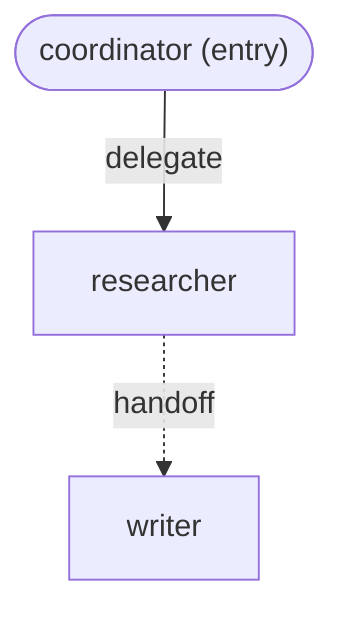

# CommonADK

CommonADK is a LiteLLM-style layer for agent SDKs: define an agent system
once, in a framework-neutral `common/` folder, and materialize it into any
supported agent SDK — no hand-written per-SDK agent code, no copy-pasted
prompts or tool wrappers per framework.

**Hypothesis:** an agent system can be defined once and built, unmodified,
on multiple SDKs. The bet CommonADK makes is that `common/` can be the single
source of truth, with a thin runtime adapter per SDK doing the translation —
the same way LiteLLM lets you call any LLM provider through one interface.
The v1 success criterion (see [`plan.md`](plan.md)): the same `common/`
folder builds and runs unmodified on both Google ADK and the OpenAI Agents
SDK. It does — [`examples/research-crew`](examples/research-crew) is proof.

## Quickstart

Install with the extra(s) for the SDK(s) you want to build against:

```bash
pip install "commonadk[google]"   # Google ADK target
pip install "commonadk[openai]"   # OpenAI Agents SDK target
pip install "commonadk[claude]"   # Claude Agent SDK target
pip install "commonadk[google,openai,claude]"   # all three
```

Point it at the shipped example, a three-agent research crew
(`coordinator` → `researcher` → `writer`):

```python
import commonadk

project = commonadk.load("examples/research-crew/common")   # parse + validate
agent = project.build("coordinator", target="google-adk")   # live google.adk.Agent
agent = project.build("coordinator", target="openai")       # live agents.Agent
options = project.build("coordinator", target="claude")     # claude_agent_sdk.ClaudeAgentOptions
```

(`target="claude"` needs each agent's `agent-config.yaml` to carry a
`targets.claude.model` override, since the example's default models are
gemini — see "Supported targets" below.)

Or from the command line:

```bash
commonadk validate examples/research-crew/common
commonadk render examples/research-crew/common
commonadk run examples/research-crew/common --target openai "Research electric vehicle adoption"
```

`validate` loads and checks a project, printing each agent's resolved model,
tools, and required env vars (flagging which are actually set in your
shell). `render` regenerates `interaction-layer.md` from `interactions.yaml`
so the diagram never drifts from the spec. `run` builds one agent for a
target SDK and executes a single turn — this one needs real API keys.

## The `common/` folder

```
common/
├── config.yaml              # project-wide config
├── interactions.yaml        # typed interaction edges (source of truth)
├── interaction-layer.md     # GENERATED mermaid rendering of interactions.yaml
└── <agent-name>/
    ├── skill.md              # instructions/persona -> system instructions
    ├── tools.py               # plain typed Python functions with docstrings
    └── agent-config.yaml     # per-agent config
```

**`config.yaml`** — project name, entry agent, and the model-alias table
every agent's `model:` resolves against:

```yaml
name: my-project
entry: coordinator
targets: [google-adk, openai]
default_model: fast
model_aliases:
  fast: gemini/gemini-2.5-flash
  smart: anthropic/claude-sonnet-5
```

**`<agent>/agent-config.yaml`** — model (an alias above, or a raw
LiteLLM-format string), tools, and required env vars. `requires.env`
declares **names only** — never values; `commonadk validate` and every
adapter's build-time preflight check presence, not content:

```yaml
name: researcher
model: gemini/gemini-2.5-pro
tools:
  - search_web
  - fetch_page
requires:
  env:
    - name: TAVILY_API_KEY
      description: Search API key used by search_web
      required: true
```

**`<agent>/skill.md`** — plain Markdown instructions, passed through as the
agent's system prompt (optional YAML frontmatter is stripped).

**`<agent>/tools.py`** — plain functions. Type hints on every parameter and a
docstring are **required**, checked at validate time — they're what every
adapter turns into that SDK's native tool schema:

```python
def search_web(query: str) -> str:
    """Search the web for a query and return a short summary of top results.

    Args:
        query: The search query.
    """
    ...
```

**`interactions.yaml`** — the interaction graph, source of truth:

```yaml
entry: coordinator
edges:
  - from: coordinator
    to: researcher
    type: delegate     # v1: delegate | handoff
  - from: researcher
    to: writer
    type: handoff
```

**`interaction-layer.md`** — GENERATED. `commonadk render` regenerates its
mermaid block from `interactions.yaml`, so the diagram documents the graph
instead of drifting from it:



## Supported targets

| Target | `target=` | Native model path | LiteLLM-wrapped otherwise |
|---|---|---|---|
| Google ADK | `google-adk` | bare model id when the LiteLLM string is `gemini/...` | `google.adk.models.lite_llm.LiteLlm` |
| OpenAI Agents SDK | `openai` | bare model id when the LiteLLM string is `openai/...` | `agents.extensions.models.litellm_model.LitellmModel` |
| Claude Agent SDK | `claude` | bare model id when the LiteLLM string is `anthropic/...` | **no LiteLLM path** — any other provider is a clear build-time error |

Every agent's `model:` (an alias from `config.yaml` or a raw LiteLLM string
like `anthropic/claude-sonnet-5`) resolves the same way regardless of
target; each adapter then decides whether its SDK can speak that provider
natively or needs the SDK's own LiteLLM wrapper. A per-agent
`targets.<sdk>.model` override in `agent-config.yaml` bypasses resolution
entirely and is passed through as-is, for when you need an SDK-native model
form commonadk doesn't infer.

The Claude Agent SDK runs Anthropic models only — it has no LiteLLM wrapper
at all, so an agent whose model resolves to any provider other than
`anthropic/...` fails to build for `target="claude"` with a clear error
naming the agent, its resolved model string, and how to fix it (an
`anthropic/...` model, a different alias, or a `targets.claude.model`
override). This is why research-crew's `agent-config.yaml` files each carry
a `targets.claude.model: claude-sonnet-5` override — the project's default
models are gemini.

## Delegate and handoff, per SDK

`interactions.yaml` has one edge vocabulary — `delegate` and `handoff` — but
the two SDKs express "one agent routes work to another" through genuinely
different data shapes, and each adapter honors that shape rather than
flattening it away. Google ADK's `sub_agents` form a strict **tree**: an
agent instance can have exactly one parent, so a `common/` graph reachable
from the build root must itself be a tree, or the adapter raises before
constructing anything (a cycle, or an agent reachable from two parents, is
rejected up front). The OpenAI Agents SDK's `handoffs` are a plain list of
**references**: the same `Agent` instance can sit in more than one parent's
`handoffs` list, and cycles are just references wired up after construction.
So the identical `interactions.yaml` — including graphs with a shared
sub-agent or even a cycle — builds happily as an OpenAI Agents handoff graph
while the same shape can be legitimately rejected for Google ADK. (v1 does
not yet distinguish `delegate` from `handoff` *within* either adapter — both
edge types map to the one mechanism each SDK exposes today.)

The Claude Agent SDK is session/query-based, not agent-object-based: instead
of a live agent, `project.build(..., target="claude")` returns a
`claude_agent_sdk.ClaudeAgentOptions` — the config object you pass to that
SDK's `query()`. Its subagents (`options.agents`) are declared once, in a
single **flat** `dict[str, AgentDefinition]`, not a nested tree — and per
the SDK's own docs, any agent whose tools include the Agent tool can invoke
*any* name in that flat registry, not just a parent-declared child. So this
adapter registers every agent reachable from the build root (the whole
transitive closure, however deep) into that one flat dict, and grants Agent
tool access only to the reachable agents that actually have an outgoing
edge in `interactions.yaml` — a deep edge (e.g. `researcher -> writer` when
building `coordinator`) is fully representable this way, and — like OpenAI
Agents' reference-based `handoffs` — a shared sub-agent or a cycle needs no
special rejection either: the flat dict just holds one entry per logical
agent name. See `adapters/claude_agent.py`'s module docstring for the full
investigation and the tool-isolation mechanics (each agent's own
`tools.py` functions become an in-process MCP server it alone can see).

## Roadmap

CommonADK's plan and every settled design decision live in
[`plan.md`](plan.md). Notably still ahead: mixed-target spawning (pinning
individual agents to different SDKs within one project — `agent-config.yaml`
already reserves a `runtime:` key for this, unhonored in v1), richer edge
semantics (pipelines, loops, shared state), and additional adapters
(CrewAI, AutoGen, LangGraph, ...).
