# CommonADK — High-Level Design

Audience: someone deciding whether to adopt CommonADK, or where to extend it.
For field-level detail see [`LLD.md`](LLD.md) and [`file-contracts.md`](file-contracts.md).

## Problem statement and hypothesis

Every agent SDK — Google ADK, the OpenAI Agents SDK, the Claude Agent SDK,
CrewAI, AutoGen, LangGraph — wants its own shape of agent object: its own
instruction field, its own tool-wrapping convention, its own way of
expressing "this agent can route work to that one." A team that wants to
build the same multi-agent system on more than one of these — to compare
them, migrate between them, or hedge against one going away — ends up
hand-maintaining parallel implementations that drift.

CommonADK's bet is that this is the same shape of problem LiteLLM solved for
model providers: **define the system once, in a framework-neutral format,
and materialize it into any supported SDK via a thin per-SDK adapter.** The
`common/` folder — config, agent instructions, typed Python tools, and an
interaction graph — is the single source of truth. Nothing SDK-specific is
hand-written; adapters translate at build time.

**v1 success criterion** (`plan.md`): the same `common/` folder builds
unmodified on every supported SDK target. It does — six targets now:
Google ADK, the OpenAI Agents SDK, the Claude Agent SDK, CrewAI, AutoGen
(`autogen-agentchat`), and LangGraph.
[`examples/research-crew`](../examples/research-crew) is the proof, and
`test_same_project_builds_on_every_installed_target`
(`tests/test_hypothesis.py`) exercises it directly: one `Project`, loaded
once, built under each of the six `target=` strings in turn, gated per
target by `pytest.importorskip` so the test collects and runs regardless of
which SDKs happen to be installed.

## System overview

```mermaid
flowchart LR
    subgraph SRC["common/ folder (source of truth)"]
        CFG[config.yaml]
        INT[interactions.yaml]
        AGT["agent-name/&#10;skill.md + tools.py + agent-config.yaml"]
    end

    SRC --> LOADER["loader.py&#10;load()"]
    LOADER --> VALID["validation.py&#10;validate()"]
    VALID -->|errors| FAIL["ValidationError&#10;(.errors list)"]
    VALID -->|ok, + warnings| MODEL["Project&#10;(framework-neutral, resolved)"]

    MODEL --> REG["adapters registry&#10;get_adapter(target)"]
    REG --> LG[LangGraphAdapter]
    REG --> OA[OpenAIAgentsAdapter]
    REG --> AG[AutoGenAdapter]
    REG --> CA[ClaudeAgentSDKAdapter]
    REG --> GA[GoogleADKAdapter]
    REG --> CR[CrewAIAdapter]
    LG --> LGLIVE["CompiledStateGraph&#10;per-edge handoff tools"]
    OA --> OLIVE["live agents.Agent&#10;handoffs reference list"]
    AG --> AGLIVE["AssistantAgent / Swarm&#10;name-string handoffs"]
    CA --> CALIVE["ClaudeAgentOptions&#10;flat subagent registry"]
    GA --> GLIVE["live google.adk.Agent&#10;sub_agents tree"]
    CR --> CRLIVE["live crewai.Crew&#10;crew-wide delegation"]

    MODEL --> MER["mermaid.py&#10;render_mermaid / write_interaction_layer"]
    MER --> IL[interaction-layer.md]

    CLI["cli.py&#10;validate / render / run"] -.-> LOADER
    CLI -.-> REG
    CLI -.-> MER
```

`commonadk` (`src/commonadk/__init__.py`) has no agent-SDK dependency at
import time — only `pydantic` and `pyyaml`. Each adapter's SDK is imported
lazily inside `adapters/__init__.get_adapter()`, so `commonadk.load()` and
`commonadk validate`/`render` work with zero SDKs installed; only calling
`project.build(..., target=...)` or `commonadk run` needs that one target's
SDK (`pyproject.toml`'s `google`/`openai`/`claude`/`crewai`/`autogen`/
`langgraph` extras).

## Component responsibilities

Three responsibilities, matching `plan.md`'s architecture section — this is
what actually shipped in each:

**Load & validate** (`loader.py` + `validation.py` + `models.py`). Parses
`common/` into framework-neutral Pydantic models (`ProjectConfig`,
`AgentConfig`, `InteractionGraph`, `AgentSpec`, `ToolSpec`, assembled into a
`Project`). Loading is best-effort in the collection phase — every file that
can be parsed is parsed, every problem is accumulated — so one `load()` call
surfaces every error in the project at once via `ValidationError.errors`,
never just the first. Checks include: bad/missing YAML, unknown YAML keys
(`extra="forbid"` everywhere a model is populated from a `common/` file),
tools referenced in `agent-config.yaml` but not defined in `tools.py`, tools
missing type hints or a docstring, edges naming unknown agents, an
unresolvable entry agent, unresolvable model aliases, a `runtime:` naming
an unregistered target or one whose SDK isn't installed (see "Extension
points", "Mixed-target spawning" below). A missing return-type hint is a
warning, not an error — it doesn't block a load.

**Adapt** (`adapters/`). One adapter per target SDK behind `BaseAdapter`,
each turning an `AgentSpec` (plus everything reachable from it via
`interactions.yaml` edges) into a live, SDK-native object. All six adapters
share the same `BaseAdapter._check_env`/`_reachable_agents` preflight and
the same `model_params`-unsupported-key warning policy, but differ
substantially in what they build, how they route models, and how faithfully
they can express an edge — see "Comparing the six targets" below, and each
adapter's own module docstring (`src/commonadk/adapters/*.py`) for the
full, source-verified investigation behind its choices. No adapter needs
another target's SDK installed — `adapters/__init__.py`'s registry imports
each target's module only when that target is requested.

**Render** (`mermaid.py`, driven by `commonadk render`). Regenerates the
mermaid block in `common/interaction-layer.md` from `interactions.yaml`, so
the diagram documents the graph instead of drifting from it.
`test_example_interaction_layer_matches_current_graph`
(`tests/test_mermaid.py`) guards the shipped example against exactly that
drift.

## Comparing the six targets

This is the heart of the HLD: six adapters against the same `common/`
project, each SDK forcing a different answer to "what does a live agent
look like" and "how faithfully can we honor `interactions.yaml`'s edges."

| Target | extra | `build()` returns | Model routing | Edge-mapping fidelity |
|---|---|---|---|---|
| LangGraph | `langgraph` | compiled `langgraph.graph.state.CompiledStateGraph` — a lone react-agent node if the build root has no outgoing edges, else a multi-node `StateGraph` | `init_chat_model("<provider>:<model>")`, native only for `gemini/openai/anthropic` (no LiteLLM fallback); override is a langchain `"provider:model"` string, passed through as-is | **Precise, per-edge.** One `transfer_to_<destination>` handoff tool per distinct outgoing edge, scoped to the source agent only |
| OpenAI Agents SDK | `openai` | live `agents.Agent` with a `.handoffs` reference list | bare model id when the resolved provider is `openai`, else `agents.extensions.models.litellm_model.LitellmModel(resolved)`; override passed through as SDK-native form | **Per-agent references.** `handoffs` is `list[Agent \| Handoff]`, shared instances legal; multi-parent graphs and cycles build fine |
| AutoGen | `autogen` | bare `autogen_agentchat.agents.AssistantAgent` if the build root has no outgoing edges, else a ready-to-run `autogen_agentchat.teams.Swarm` | native `OpenAIChatCompletionClient`/`AnthropicChatCompletionClient` for `openai/anthropic/gemini` (gemini routed through the OpenAI client's own base-url special-casing), else `ValueError`; override → `OpenAIChatCompletionClient(bare id)`, no `model_info` | **Per-agent, by name string.** `handoffs: list[str]` resolved against the team's participants at run time; multi-parent graphs and cycles need no special handling |
| Claude Agent SDK | `claude` | fully-wired `claude_agent_sdk.ClaudeAgentOptions` — no persistent agent object, this SDK is session/query-based | bare Anthropic model id only (`ClaudeAgentOptions.model`/`AgentDefinition.model`); no LiteLLM path, `ValueError` for any other provider; override passed through as-is | **Flat subagent registry.** Every reachable agent lands once in `options.agents` (a flat `dict`); the Agent tool is granted only to agents that actually have an outgoing edge, so delegation is gated by the graph even though the underlying lookup is technically global |
| Google ADK | `google-adk` | live `google.adk.agents.Agent` with a nested `sub_agents` tree | bare model id when the resolved provider is `gemini`, else `google.adk.models.lite_llm.LiteLlm(resolved)`; override passed through as SDK-native form | **Strict tree.** An agent can have exactly one parent; a multi-parent graph or a cycle in the reachable subgraph is rejected with a clear `ValueError` before anything is constructed |
| CrewAI | `crewai` | live `crewai.Crew` — the build root as `manager_agent` of a hierarchical crew (or the sole member of a solo sequential crew if it has no reachable agents), `tasks=[]` | `crewai.LLM(model=resolved)` takes the LiteLLM-format string **directly**, for every provider — no allowlist, no unsupported-provider error at all; override passed through as-is | **Crew-wide, coarsened.** `allow_delegation=True` is all-or-nothing per agent — a delegating agent can reach *any* other crew member, not just its declared out-edges; the graph still controls *whether* an agent can delegate and *which* agents join the crew at all |

### The edge-semantics spectrum

Building the same graph six ways surfaced the project's core empirical
finding: **"one agent routes work to another" is not one concept across
these SDKs — it's a spectrum of fidelity**, from an edge-by-edge mechanism
down to a single crew-wide switch. Ordered from most faithful to coarsest:

1. **LangGraph — precise, per-edge.** Every outgoing `interactions.yaml`
   edge becomes its own individually-named, individually-invocable
   `transfer_to_<destination>` tool on the source agent. An agent with
   edges to `x` and `y` gets exactly two handoff tools and can reach
   nothing else — the graph's edge *targets*, not just its existence, are
   fully expressible. This is the one target here where nothing is lost in
   translation.
2. **OpenAI Agents / AutoGen — per-agent handoff references.** Both express
   "agent A can route to agent B" as a reference on A: a live object in
   OpenAI Agents' `handoffs` list, a plain name string in AutoGen's. Neither
   SDK tracks parentage, so both happily build graphs the tree-shaped
   target below rejects — a shared destination reachable from two parents,
   or a cycle back to the build root, is just a reference (or a string)
   appearing more than once. commonadk exploits exactly this: OpenAI
   Agents' adapter memoizes a live instance per logical agent name and
   records it in the memo *before* recursing into its own handoffs, so a
   cyclic lookup finds the in-progress instance instead of recursing
   forever; AutoGen's needs no such care at all, since a name string is
   never a construction hazard in the first place.
3. **Claude Agent SDK — flat subagent registry.** `ClaudeAgentOptions.agents`
   is a single flat `dict[str, AgentDefinition]`, not a nested tree — every
   agent reachable from the build root (however deep) is registered there
   exactly once. The Agent tool that lets a subagent invoke another one is,
   per the SDK's own docs, a lookup against that *entire* flat registry —
   technically capable of reaching any registered agent, not just a
   parent-declared child. This adapter narrows that back down to the
   graph's actual shape by granting the Agent tool only to agents that have
   an outgoing edge, so delegation happens exactly where
   `interactions.yaml` says it can, even though the underlying mechanism is
   more permissive than that.
4. **Google ADK — strict tree.** `sub_agents` enforces one parent per
   agent at the SDK level (`BaseAgent.model_post_init` raises if a shared
   instance already has a parent). This is the one target where the graph
   itself must be shaped correctly *before* commonadk can build it at all —
   a multi-parent graph or a cycle in the reachable subgraph is rejected
   with a clear error naming the conflicting edge, not silently degraded.
5. **CrewAI — crew-wide delegation, coarsest.** CrewAI has exactly one
   delegation mechanism, and it isn't per-edge at all:
   `allow_delegation=True` gives an agent delegation tools targeting *every
   other* crew member, with no concept of "only the agents
   `interactions.yaml` points this agent at." Edge *targets* are simply not
   representable here. What survives translation is coarser but real:
   *whether* an agent can delegate at all (gated by having ≥1 outgoing
   edge), and *scope* (only agents actually reachable from the build root
   join the crew, so an unrelated part of a larger graph is never a
   delegation target just because it exists elsewhere in `common/`).

No target in this spectrum is "wrong" — each adapter is honest about
exactly how much of `interactions.yaml` its underlying SDK can express, and
documents the gap (if any) rather than papering over it. A project author
picking a target should read this table as "how much of my delegation
graph survives," not just "does it build."

## Key design decisions

**Runtime factory, not codegen.** `project.build(name, target=...)`
instantiates live SDK objects directly — there is no generated
`coordinator_google_adk.py` sitting in the repo. This keeps the `common/`
folder the only thing a human edits; regenerating "the Google ADK version"
after a spec change is just calling `build()` again, not re-running a
codegen step and diffing its output. The cost is that adapters must be
correct at every build, not just at generation time — there's no
checked-in generated file to eyeball.

**`interactions.yaml` as source of truth, mermaid as generated
documentation.** The interaction graph is structured data
(`InteractionGraph`/`InteractionEdge`, `type: Literal["delegate",
"handoff"]`) precisely so it can be validated (unknown agents, bad edge
types) and consumed programmatically by every adapter. The mermaid
block in `interaction-layer.md` is a *rendering* of that data
(`mermaid.render_mermaid`), regenerated by `commonadk render`, never
hand-edited — its own generated-file header says so.

**LiteLLM model strings as the neutral form; each target decides its own
native path.** `agent-config.yaml`'s `model:` is always a LiteLLM-format
string (`provider/model-id`) or an alias resolved against `config.yaml`'s
`model_aliases` (`Project.resolve_model`). What each adapter does with that
string is genuinely different per target, not a uniform "native or
LiteLLM-wrap" rule: Google ADK and OpenAI Agents fall back to the SDK's own
LiteLLM wrapper for any provider they don't speak natively; CrewAI hands
the LiteLLM string straight to `crewai.LLM`, which speaks it natively for
every provider with no fallback needed; Claude, AutoGen, and LangGraph have
*no* LiteLLM path at all and raise a clear, actionable `ValueError` for a
provider outside their own native client(s). One model string per agent
still works unmodified across every target whose native/fallback path
covers it; a per-target `targets.<target>.model` override in
`agent-config.yaml` is the escape hatch for an SDK-native form commonadk
can't infer — its *expected form* differs per target (see
[`file-contracts.md`](file-contracts.md#targets--per-target-overrides)).

**Env requirements declared by name only.** `requires.env` in
`agent-config.yaml` lists env var *names* (plus a description and a
required/optional flag) — never values. `Project.check_env()` and every
adapter's `_check_env` preflight (`adapters/base.py`) check *presence* in
`os.environ`, not content, and fail loudly with the full list of what's
missing before any SDK object is constructed. Secrets never pass through
commonadk's config surface at all. (Separately, three targets' own model
clients — AutoGen's and LangGraph's `openai`/`google_genai` paths — construct
their underlying provider SDK client eagerly and fail on a missing provider
API key all by themselves; this is that SDK's own behavior, not something
`requires.env`/`_check_env` mediates — see each adapter's docstring,
"Offline construction.")

**Strict YAML schemas.** Every model populated straight from a `common/`
YAML file (`ProjectConfig`, `AgentConfig`, `Requires`, `EnvRequirement`,
`InteractionGraph`, `InteractionEdge`) sets `model_config =
ConfigDict(extra="forbid")`. A typo'd key (`modle:` instead of `model:`)
is a load-time `ValidationError`, not a silently-ignored field —
`test_unknown_yaml_key_errors` covers this directly.

**v1 edge-semantics intersection: `delegate` and `handoff` only.**
`interactions.yaml` supports exactly two edge types. No adapter currently
distinguishes them in how it builds — every one of the six maps both to
the one routing mechanism its SDK exposes today (ADK `sub_agents`, OpenAI
Agents `handoffs`, Claude subagents, CrewAI delegation, AutoGen handoffs,
LangGraph transfer tools) — but the distinction is preserved in the
neutral model precisely so a future adapter version (or a future SDK
capability) can honor it without touching `interactions.yaml`. Richer
semantics (pipelines, loops, shared state) are explicitly deferred
(`plan.md`, "Deferred / roadmap").

**Single target per `build()` call, by design — `build_mixed()` is the
separate, opt-in entry point for more than one.** `project.build(agent_name,
target=...)` still instantiates the *whole* reachable interaction graph
under one SDK, unconditionally — it never reads `runtime:` at all, so this
sentence is still true of it word for word. Spanning more than one SDK in
one build is `project.build_mixed(agent_name, default_target=...)` (see
"Extension points" below), a second, additive entry point rather than a
change to `build()`'s contract — keeping the two calls separate is what
lets every single-target project (every one that existed before this
feature, and any new one that never sets `runtime:`) keep the simple
mental model unchanged: one call, one SDK, one live object graph.

## Extension points

**Adding a new adapter.** The registry pattern that shipped for the first
two targets held unchanged through all four that followed it — six
adapters later, it's still three pieces: (1) a module under `adapters/`
whose class subclasses `BaseAdapter`, sets `target: str`, and implements
`build(self, project, agent_name) -> Any`, calling `self._check_env(...)`
up front and reusing `self._reachable_agents(...)` if the target needs
transitive-dependency information (every adapter shipped so far does); (2)
one entry in `adapters/__init__.py`'s `_REGISTRY` mapping the target name
to `(module_path, class_name, pip_extra)`; (3) an optional extra in
`pyproject.toml`'s `[project.optional-dependencies]` naming that target's
SDK package(s), so `pip install "commonadk[<extra>]"` is the install story
and a missing SDK produces `get_adapter`'s `ImportError` install hint
rather than a bare `ModuleNotFoundError`. No changes to `loader.py`,
`validation.py`, or `models.py` are needed — a new adapter only ever
consumes `Project`, never extends it. The one recurring piece of real work
per adapter, per the four that shipped after the first two, is not the
registry wiring but investigating the target SDK itself directly against
its installed version — construction quirks, model-routing tables, edge
representability — and writing that investigation into the module
docstring rather than assuming it from memory of the API (every adapter in
this codebase documents exactly which installed version it was verified
against).

**Roadmap** (full detail in [`plan.md`](../plan.md), "Deferred / roadmap"):

- **Mixed-target spawning — shipped for the in-process case.** `runtime:`
  (`models.py`, `AgentConfig`) now pins an individual agent to its own SDK,
  and `project.build_mixed(agent_name, default_target=...)` builds every
  agent reachable from `agent_name` across however many runtimes their
  `runtime:` values name (falling back to `default_target` for any agent
  that leaves it unset — a project that sets no agent's `runtime:` behaves
  identically to a plain `build()` call). This composes directly with "the
  edge-semantics spectrum" above rather than sitting beside it: agents that
  share a runtime and are connected by `interactions.yaml` edges are still
  built as ONE native sub-graph by that runtime's own adapter, so an ADK
  `sub_agents` tree stays a strict tree and a LangGraph handoff stays
  per-edge — the fidelity table above is exactly what a same-runtime
  "island" gets. Only edges that *cross* runtimes fall outside any single
  adapter's fidelity story; those are bridged as a plain callable tool on
  the crossing edge's source agent (the project's core "every SDK wraps a
  plain typed function into a tool" insight, applied one level up, from
  `tools.py` functions to whole islands). Not every target can source such
  a bridge — `google-adk`, `openai`, `crewai`, and `claude` can in v1;
  `autogen` and `langgraph` cannot, for verified, SDK-specific reasons (a
  private, unversioned tool-list attribute; a graph that's already compiled
  by the time `build()` returns) — while every target can still be a
  bridge's *destination*. See
  [`mixed-target-design.md`](mixed-target-design.md) for the full design:
  the three-layer model, the island-computation algorithm, and this
  supported/unsupported table with its evidence. Cross-SDK edges spanning
  two separate *processes* still need a wire protocol (A2A is the leading
  candidate per `plan.md`) — the design doc's "Out of scope" section spells
  out exactly where that plugs into what shipped here.
- **Richer edge semantics** — sequential/parallel pipelines, loops, shared
  state — beyond today's `delegate`/`handoff` intersection.
