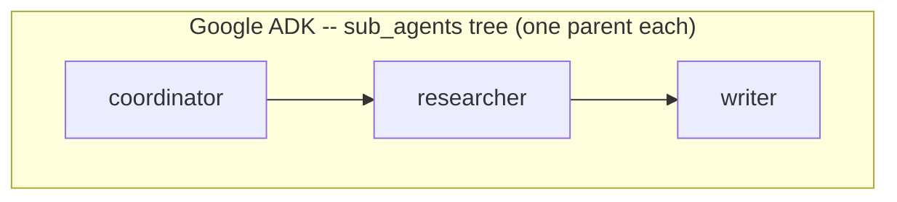
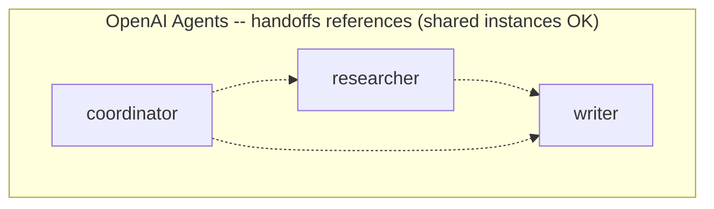

# CommonADK — High-Level Design

Audience: someone deciding whether to adopt CommonADK, or where to extend it.
For field-level detail see [`LLD.md`](LLD.md) and [`file-contracts.md`](file-contracts.md).

## Problem statement and hypothesis

Every agent SDK (Google ADK, the OpenAI Agents SDK, and others) wants its own
shape of agent object: its own instruction field, its own tool-wrapping
convention, its own way of expressing "this agent can route work to that
one." A team that wants to build the same multi-agent system on two SDKs —
to compare them, migrate between them, or hedge against one going away — ends
up hand-maintaining two parallel implementations that drift.

CommonADK's bet is that this is the same shape of problem LiteLLM solved for
model providers: **define the system once, in a framework-neutral format,
and materialize it into any supported SDK via a thin per-SDK adapter.** The
`common/` folder — config, agent instructions, typed Python tools, and an
interaction graph — is the single source of truth. Nothing SDK-specific is
hand-written; adapters translate at build time.

**v1 success criterion** (`plan.md`): the same `common/` folder builds and
runs unmodified on both Google ADK and the OpenAI Agents SDK. It does —
[`examples/research-crew`](../examples/research-crew) is the proof, and
`test_same_project_builds_on_both_targets` (`tests/test_adapter_openai.py`)
exercises it directly.

## System overview

```mermaid
flowchart LR
    subgraph SRC["common/ folder (source of truth)"]
        CFG[config.yaml]
        INT[interactions.yaml]
        AGT["agent-name/&#10;skill.md + tools.py + agent-config.yaml"]
    end

    SRC --> LOADER["loader.py&#10;load()"]
    LOADER --> VALID["validation.py&#10;validate()"]
    VALID -->|errors| FAIL["ValidationError&#10;(.errors list)"]
    VALID -->|ok, + warnings| MODEL["Project&#10;(framework-neutral, resolved)"]

    MODEL --> REG["adapters registry&#10;get_adapter(target)"]
    REG --> GA[GoogleADKAdapter]
    REG --> OA[OpenAIAgentsAdapter]
    GA --> GLIVE["live google.adk.Agent&#10;sub_agents tree"]
    OA --> OLIVE["live agents.Agent&#10;handoffs graph"]

    MODEL --> MER["mermaid.py&#10;render_mermaid / write_interaction_layer"]
    MER --> IL[interaction-layer.md]

    CLI["cli.py&#10;validate / render / run"] -.-> LOADER
    CLI -.-> REG
    CLI -.-> MER
```

`commonadk` (`src/commonadk/__init__.py`) has no agent-SDK dependency at
import time — only `pydantic` and `pyyaml`. Each adapter's SDK is imported
lazily inside `adapters/__init__.get_adapter()`, so `commonadk.load()` and
`commonadk validate`/`render` work with zero SDKs installed; only calling
`project.build(..., target=...)` or `commonadk run` needs that one target's
SDK (`pyproject.toml`'s `google`/`openai` extras).

## Component responsibilities

Three responsibilities, matching `plan.md`'s architecture section — this is
what actually shipped in each:

**Load & validate** (`loader.py` + `validation.py` + `models.py`). Parses
`common/` into framework-neutral Pydantic models (`ProjectConfig`,
`AgentConfig`, `InteractionGraph`, `AgentSpec`, `ToolSpec`, assembled into a
`Project`). Loading is best-effort in the collection phase — every file that
can be parsed is parsed, every problem is accumulated — so one `load()` call
surfaces every error in the project at once via `ValidationError.errors`,
never just the first. Checks include: bad/missing YAML, unknown YAML keys
(`extra="forbid"` everywhere a model is populated from a `common/` file),
tools referenced in `agent-config.yaml` but not defined in `tools.py`, tools
missing type hints or a docstring, edges naming unknown agents, an
unresolvable entry agent, unresolvable model aliases. A missing return-type
hint and a set `runtime:` key are warnings, not errors — they don't block a
load.

**Adapt** (`adapters/`). One adapter per target SDK behind `BaseAdapter`.
`GoogleADKAdapter.build()` turns an `AgentSpec` into a live
`google.adk.agents.Agent`, walking `interactions.yaml` edges into
`sub_agents`. `OpenAIAgentsAdapter.build()` turns it into a live
`agents.Agent`, walking the same edges into `handoffs`. Both wrap
`tools.py` functions into the target SDK's native tool type
(`google.adk`'s bare-function tool list; `agents.function_tool`). Neither
adapter needs the other's SDK installed — `adapters/__init__.py`'s registry
imports each target's module only when that target is requested.

**Render** (`mermaid.py`, driven by `commonadk render`). Regenerates the
mermaid block in `common/interaction-layer.md` from `interactions.yaml`, so
the diagram documents the graph instead of drifting from it.
`test_example_interaction_layer_matches_current_graph`
(`tests/test_mermaid.py`) guards the shipped example against exactly that
drift.

## Key design decisions

**Runtime factory, not codegen.** `project.build(name, target=...)`
instantiates live SDK objects directly — there is no generated
`coordinator_google_adk.py` sitting in the repo. This keeps the `common/`
folder the only thing a human edits; regenerating "the Google ADK version"
after a spec change is just calling `build()` again, not re-running a
codegen step and diffing its output. The cost is that adapters must be
correct at every build, not just at generation time — there's no
checked-in generated file to eyeball.

**`interactions.yaml` as source of truth, mermaid as generated
documentation.** The interaction graph is structured data
(`InteractionGraph`/`InteractionEdge`, `type: Literal["delegate",
"handoff"]`) precisely so it can be validated (unknown agents, bad edge
types) and consumed programmatically by two different adapters. The mermaid
block in `interaction-layer.md` is a *rendering* of that data
(`mermaid.render_mermaid`), regenerated by `commonadk render`, never
hand-edited — its own generated-file header says so.

**LiteLLM model strings everywhere, native routing per target.**
`agent-config.yaml`'s `model:` is always a LiteLLM-format string
(`provider/model-id`) or an alias resolved against `config.yaml`'s
`model_aliases` (`Project.resolve_model`). Each adapter then decides, at
build time, whether its SDK can speak that provider natively — Google ADK
takes a bare model id when the provider is `gemini`; the OpenAI Agents SDK
takes a bare id when the provider is `openai` — or falls back to the SDK's
own LiteLLM wrapper (`google.adk.models.lite_llm.LiteLlm`,
`agents.extensions.models.litellm_model.LitellmModel`) for everything else.
One model string per agent works unmodified on both SDKs; a per-target
`targets.<sdk>.model` override in `agent-config.yaml` is the escape hatch
for an SDK-native form commonadk can't infer.

**Env requirements declared by name only.** `requires.env` in
`agent-config.yaml` lists env var *names* (plus a description and a
required/optional flag) — never values. `Project.check_env()` and every
adapter's `_check_env` preflight (`adapters/base.py`) check *presence* in
`os.environ`, not content, and fail loudly with the full list of what's
missing before any SDK object is constructed. Secrets never pass through
commonadk's config surface at all.

**Strict YAML schemas.** Every model populated straight from a `common/`
YAML file (`ProjectConfig`, `AgentConfig`, `Requires`, `EnvRequirement`,
`InteractionGraph`, `InteractionEdge`) sets `model_config =
ConfigDict(extra="forbid")`. A typo'd key (`modle:` instead of `model:`)
is a load-time `ValidationError`, not a silently-ignored field —
`test_unknown_yaml_key_errors` covers this directly.

**v1 edge-semantics intersection: `delegate` and `handoff` only.**
`interactions.yaml` supports exactly the two edge types both target SDKs
can express today. Neither adapter currently distinguishes them in how it
builds — both map to the one routing mechanism each SDK exposes (ADK
`sub_agents`, OpenAI Agents `handoffs`) — but the distinction is preserved
in the neutral model precisely so a future adapter version (or a future SDK
capability) can honor it without touching `interactions.yaml`. Richer
semantics (pipelines, loops, shared state) are explicitly deferred
(`plan.md`, "Deferred / roadmap").

**Single target per build.** `project.build(agent_name, target=...)`
instantiates the *whole* reachable interaction graph under one SDK. Mixing
SDKs within one build is future work (see "Extension points" below); v1
keeps the mental model simple — one call, one SDK, one live object graph.

## The structural asymmetry between targets

This is the one place where "just walk the graph" isn't enough, and it's
the flagship design insight of the adapter layer: **the same
`interactions.yaml` graph is legal for one SDK and illegal for the other,
because the two SDKs model "route to another agent" with genuinely
different data shapes.**

Google ADK's `sub_agents` form a strict **tree**: `BaseAgent`'s own
`model_post_init` sets each sub-agent's `parent_agent`, and raises if that
sub-agent instance already has one. An agent can have exactly one parent.
The OpenAI Agents SDK's `handoffs` are a plain **list of references**: an
`Agent`'s `handoffs` field is just `list[Agent | Handoff]`, with no
parent-tracking at all — the same `Agent` instance can legally sit in more
than one parent's `handoffs` list, and a cycle is just two instances
referencing each other after both already exist.

So `GoogleADKAdapter._build_agent` (`adapters/google_adk.py`) walks
`interactions.yaml` itself, *before* constructing any `Agent`, tracking
which logical agent names are already `claimed` by a parent and which
`ancestors` are on the current recursion path. If the same agent name is
reachable from two parents, or from itself (a cycle), it raises a clear
`ValueError` naming the conflicting edge — instead of letting
`google-adk`'s own guard fire. That guard exists but isn't enough on its
own: it only catches *sharing one Python instance* as two parents'
sub-agent; naively building a fresh instance per parent would sail right
past it and silently duplicate the agent in the tree instead of erroring.

`OpenAIAgentsAdapter._get_or_build` (`adapters/openai_agents.py`) instead
memoizes: it builds each logical agent name **once**, records it in a
`dict[str, Agent]` *before* recursing into its own handoff targets, and
fills in `.handoffs` afterward. That "record before recurse" order is what
makes a cycle safe — a recursive call that loops back to an agent already
under construction finds it in the memo and reuses the reference instead of
recursing forever — and it's why the identical graph that Google ADK
rejects builds successfully here (`test_multi_parent_graph_builds_with_shared_instance`,
`test_cyclic_graph_builds_with_wired_handoff_references`, both in
`tests/test_adapter_openai.py`). The shipped example graph
(`coordinator --delegate--> researcher --handoff--> writer`) is a clean
tree specifically so it builds on *both* targets — its rendered mermaid
diagram is in [`../README.md`](../README.md#the-common-folder) and in the
generated [`examples/research-crew/common/interaction-layer.md`](../examples/research-crew/common/interaction-layer.md).

## Extension points

**Adding a new adapter.** Three pieces: (1) a module under `adapters/`
whose class subclasses `BaseAdapter`, sets `target: str`, and implements
`build(self, project, agent_name) -> Any`, calling `self._check_env(...)`
up front and reusing `self._reachable_agents(...)` if the target needs
transitive-dependency information; (2) one entry in `adapters/__init__.py`'s
`_REGISTRY` mapping the target name to `(module_path, class_name,
pip_extra)`; (3) an optional extra in `pyproject.toml`'s
`[project.optional-dependencies]` naming that target's SDK package(s), so
`pip install "commonadk[<extra>]"` is the install story and a missing SDK
produces `get_adapter`'s `ImportError` install hint rather than a bare
`ModuleNotFoundError`. No changes to `loader.py`, `validation.py`, or
`models.py` are needed — a new adapter only ever consumes `Project`, never
extends it. `plan.md` names CrewAI, LangGraph, and the Claude Agent SDK as
roadmap candidates; no adapter module exists for them yet — "a folder
appears only when the adapter lands."

**Roadmap** (full detail in [`plan.md`](../plan.md), "Deferred / roadmap"):

- **Mixed-target spawning.** Pinning individual agents to different SDKs
  within one project (e.g. `researcher` on Google ADK, `writer` on OpenAI
  Agents), instead of one target per `build()` call. `AgentConfig` already
  reserves a `runtime:` field for this (`models.py`); it's unset in every
  shipped agent, and `validation._check_runtime` warns — but does not
  error — if it's set, because nothing honors it yet. Cross-SDK edges will
  need a wire protocol between the two live agent graphs (A2A is the
  leading candidate per `plan.md`); adapters will grow an "expose/consume
  remote agent" path when that lands.
- **Richer edge semantics** — sequential/parallel pipelines, loops, shared
  state — beyond today's `delegate`/`handoff` intersection.
- **Additional adapters** — CrewAI, LangGraph, Claude Agent SDK, per the
  extension point above.
