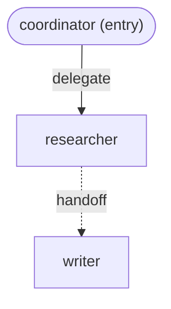

# Demo runs

Every command output on this page was actually run in this environment and
pasted verbatim (trimmed for readability where noted — elisions are marked
`# ...`) — nothing here is a fabricated or hand-written transcript. This
complements [`file-contracts.md`](file-contracts.md) and
[`HLD.md`](HLD.md): those explain the shapes; this page shows the real thing
running. See also [`examples/demo.py`](../examples/demo.py), the script
these captures come from (sections 4 and 5) or that reproduces the same
`commonadk` CLI commands (sections 1–3).

No API keys exist in this environment, and none of the captures below used
one — every `commonadk validate`/`render` and every `project.build(...)`
call is pure, local, offline construction (see "Running for real" at the
bottom for what a live `commonadk run` actually needs, per target).

## `commonadk --version`

```
$ commonadk --version
commonadk 0.0.1
```

## `commonadk validate examples/research-crew/common`

Full, unedited output:

```
$ commonadk validate examples/research-crew/common
Project: research-crew  (entry agent: coordinator)

Agents:
  coordinator
    model: fast -> gemini/gemini-2.5-flash
    tools: format_handoff_note, split_into_subtopics
    env: (none required)
  researcher
    model: gemini/gemini-2.5-pro -> gemini/gemini-2.5-pro
    tools: fetch_page, search_web
    env:
      TAVILY_API_KEY: not set (required) -- Search API key used by search_web
      POSTGRES_DSN: not set (optional) -- Connection string for the citations database
  writer
    model: fast -> gemini/gemini-2.5-flash
    tools: count_words, format_as_markdown
    env: (none required)
```

## `commonadk render examples/research-crew/common`

```
$ commonadk render examples/research-crew/common
Wrote examples/research-crew/common/interaction-layer.md
```

The file it (re)writes — `examples/research-crew/common/interaction-layer.md`
— already matched this exact output before the run (that's what
`test_example_interaction_layer_matches_current_graph` guards), so this
command was a no-op rewrite here:



## `python3 examples/demo.py`

The interesting sections, captured from a real run in this environment with
**no** env vars pre-set (the script self-provisions every placeholder it
needs — see `tests/test_demo.py`, which asserts exactly this by stripping
those vars before running it as a subprocess). Full output is ~75 lines;
elided parts are marked.

**Section 1 — project summary** (agents, resolved models, env requirements):

```
==============================================================================
1. Load and validate examples/research-crew/common
==============================================================================
Project: research-crew  (entry agent: 'coordinator')
Model aliases: {'fast': 'gemini/gemini-2.5-flash', 'smart': 'anthropic/claude-sonnet-5'}

Agents:
  - coordinator
      model: fast -> gemini/gemini-2.5-flash
      tools: format_handoff_note, split_into_subtopics
      env requirements: (none)
  - researcher
      model: gemini/gemini-2.5-pro -> gemini/gemini-2.5-pro
      tools: fetch_page, search_web
      env requirement: TAVILY_API_KEY (required, currently not set) -- Search API key used by search_web
      env requirement: POSTGRES_DSN (optional, currently not set) -- Connection string for the citations database
  - writer
      model: fast -> gemini/gemini-2.5-flash
      tools: count_words, format_as_markdown
      env requirements: (none)
```

**Section 4 — building `coordinator` for all six targets** (this is the
core proof: the same `common/` folder, unmodified, building on every
supported SDK):

```
==============================================================================
4. Build 'coordinator' for all six supported targets
==============================================================================
[google-adk] OK -- google.adk.agents.llm_agent.LlmAgent
    shape (sub_agents tree): root='coordinator', sub_agents=['researcher']
    (2 expected warning(s) suppressed -- per-adapter model_params/tool quirks documented in adapters/google_adk*.py)
[openai] OK -- agents.agent.Agent
    shape (handoff graph): root='coordinator', handoffs=['researcher']
[claude] OK -- claude_agent_sdk.types.ClaudeAgentOptions
    shape (options subagents (flat registry)): root has no name field (session/query-based); options.agents=['researcher', 'writer']
    (4 expected warning(s) suppressed -- per-adapter model_params/tool quirks documented in adapters/claude*.py)
[crewai] OK -- crewai.crew.Crew
    shape (crew members): process=hierarchical, manager='coordinator', members=['researcher', 'writer']
    (11 expected warning(s) suppressed -- per-adapter model_params/tool quirks documented in adapters/crewai*.py)
  (setting placeholder OPENAI_API_KEY / ANTHROPIC_API_KEY / GEMINI_API_KEY -- these are short, obviously-fake strings, used ONLY to satisfy the autogen/langgraph model clients' eager offline construction check; see those adapters' module docstrings, 'Offline construction'. No network call is ever made and no real key is required for build().)
[autogen] OK -- autogen_agentchat.teams._group_chat._swarm_group_chat.Swarm
    shape (swarm participants): Swarm participants=['coordinator', 'researcher', 'writer']
[langgraph] OK -- langgraph.graph.state.CompiledStateGraph
    shape (graph nodes): StateGraph nodes=['coordinator', 'researcher', 'writer']
```

Note the shape of each `build()` return value lines up exactly with
[`HLD.md`'s "Comparing the six targets"](HLD.md#comparing-the-six-targets):
Google ADK's tree (`sub_agents=['researcher']` — `writer` is one level
deeper, under `researcher`), OpenAI Agents' handoff reference list, Claude's
flat `options.agents` registry, CrewAI's hierarchical crew (manager +
members), AutoGen's `Swarm` participant list, and LangGraph's node-keyed
`StateGraph`.

**Section 5 — the two demonstrated failure modes**:

```
==============================================================================
5. Demonstrated failure modes (on purpose)
==============================================================================
DEMONSTRATION 1 of 2: building with a required env var unset.
researcher/agent-config.yaml declares TAVILY_API_KEY as required.
Temporarily unsetting it and attempting project.build(..., target="openai") on purpose:
  Raised OSError as expected:
    commonadk: missing required environment variable(s) for target 'openai' (building 'coordinator'):
      - researcher: TAVILY_API_KEY (Search API key used by search_web)

DEMONSTRATION 2 of 2: building for an unrecognized target string.
Attempting project.build(..., target="not-a-real-sdk") on purpose:
  Raised ValueError as expected: Unknown build target 'not-a-real-sdk'. Known targets: ['autogen', 'claude', 'crewai', 'google-adk', 'langgraph', 'openai']

==============================================================================
Done -- exiting 0
==============================================================================
```

`python3 examples/demo.py` exits `0` — captured directly (`echo $?` after
the run above printed `0`).

## `commonadk run` — the clean missing-env error

This is the same failure mode as demo.py's Demonstration 1, but through the
actual CLI entry point rather than a direct `project.build()` call — real,
captured output, `TAVILY_API_KEY` genuinely unset in the shell:

```
$ unset TAVILY_API_KEY
$ commonadk run examples/research-crew/common --target openai --agent researcher "test prompt"
commonadk: missing required environment variable(s) for target 'openai' (building 'researcher'):
  - researcher: TAVILY_API_KEY (Search API key used by search_web)
$ echo $?
1
```

And the unknown-target error, also real and captured:

```
$ commonadk run examples/research-crew/common --target nope "test prompt"
commonadk: Unknown build target 'nope'. Known targets: ['autogen', 'claude', 'crewai', 'google-adk', 'langgraph', 'openai']
$ echo $?
1
```

Both preflights run **before** any SDK object is touched — `run` never gets
as far as importing `openai-agents` or evaluating the `--target` string
against a live adapter in either case (see
[`LLD.md`'s error taxonomy](LLD.md#error-taxonomy)).

## Running for real

Everything above is offline construction — no LLM was ever called. Actually
running `commonadk run <common-dir> --target <target> "<prompt>"` against a
live model additionally needs, **on top of** whatever `requires.env`
declares per-agent (`TAVILY_API_KEY` for `researcher`, in the shipped
example, on every target — that's a tool credential, not a model-provider
one, and every target needs it identically):

**None of the commands below were run** — this environment has no API keys,
and the task rules for this pass forbid fabricating LLM output. The env
vars and commands are derived directly from each adapter's own model-routing
code (`src/commonadk/adapters/*.py`) and the underlying SDK/`litellm`
conventions each adapter routes through, not guessed:

| Target | Env var(s) needed for the shipped example's models | Why (source) | Example command |
|---|---|---|---|
| `google-adk` | `GOOGLE_API_KEY` or `GEMINI_API_KEY` | The example's models resolve to `gemini/...`, which `google_adk.py`'s `_model_for` passes through as a **bare native id** — ADK's own Gemini model client reads the key from the environment | `export TAVILY_API_KEY=... GEMINI_API_KEY=...`<br>`commonadk run examples/research-crew/common --target google-adk "Research electric vehicle adoption"` |
| `openai` | `GEMINI_API_KEY` (or `GOOGLE_API_KEY`) — because the example's models are `gemini/...`, not `openai/...` | Non-`openai/...` models are wrapped in `agents.extensions.models.litellm_model.LitellmModel` (`openai_agents.py`'s `_model_for`), which routes through `litellm` — `litellm` reads the provider-appropriate key itself (`GEMINI_API_KEY`/`GOOGLE_API_KEY` for a `gemini/...` model string) | `export TAVILY_API_KEY=... GEMINI_API_KEY=...`<br>`commonadk run examples/research-crew/common --target openai "Research electric vehicle adoption"` |
| `claude` | `ANTHROPIC_API_KEY` | The Claude Agent SDK's bundled CLI needs it to authenticate — `cli.py`'s `_run_claude` preflights this itself, since (per `claude_agent.py`'s module docstring) nothing in the SDK declares or checks for it the way `requires.env` does; also required for the SDK's own model calls once running (the shipped example's per-agent `targets.claude.model: claude-sonnet-5` overrides are already in place, so no `agent-config.yaml` changes are needed) | `export TAVILY_API_KEY=... ANTHROPIC_API_KEY=...`<br>`commonadk run examples/research-crew/common --target claude "Research electric vehicle adoption"` |
| `crewai` | `GEMINI_API_KEY` (or `GOOGLE_API_KEY`) | `crewai.LLM(model="gemini/...")` (`crewai_adapter.py`'s `_llm_for`) parses the LiteLLM-format string itself and routes `gemini` to a native client that reads the same key | `export TAVILY_API_KEY=... GEMINI_API_KEY=...`<br>`commonadk run examples/research-crew/common --target crewai "Research electric vehicle adoption"` |
| `autogen` | `GEMINI_API_KEY` | `autogen_adapter.py`'s `_client_for` routes `gemini/...` through `OpenAIChatCompletionClient`, whose own `__init__` special-cases a `"gemini-"`-prefixed model name and reads `GEMINI_API_KEY` from the environment when no `api_key` kwarg is given (this is also the var `build()` itself needs just to *construct* the client — see "Offline construction" in that adapter's module docstring, and the placeholder value `examples/demo.py` sets for exactly this reason) | `export TAVILY_API_KEY=... GEMINI_API_KEY=...`<br>`commonadk run examples/research-crew/common --target autogen "Research electric vehicle adoption"` |
| `langgraph` | `GOOGLE_API_KEY` or `GEMINI_API_KEY` | `langgraph_adapter.py`'s `_model_for` routes `gemini/...` through `init_chat_model("google_genai:...")`, whose `ChatGoogleGenerativeAI` construction is eager and raises immediately without one of these two (same "Offline construction" note as `autogen`, and the same reason `examples/demo.py` sets a placeholder) | `export TAVILY_API_KEY=... GOOGLE_API_KEY=...`<br>`commonadk run examples/research-crew/common --target langgraph "Research electric vehicle adoption"` |

If you swap any agent's `model:` to an `openai/...` string instead (or add
a `targets.<target>.model` override), the required key changes accordingly
— `OPENAI_API_KEY` for a native or LiteLLM-routed `openai/...` model on any
target. See [`file-contracts.md`'s per-target override table](file-contracts.md#targets--per-target-overrides)
for exactly what form each target's override expects.
