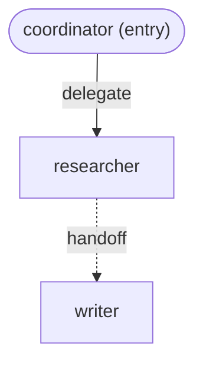

# CommonADK — `common/` File Contracts

The authoritative reference for authoring a `common/` folder. Every field
table here is read directly off the Pydantic models in
[`src/commonadk/models.py`](../src/commonadk/models.py); every example is
the shipped [`examples/research-crew/common`](../examples/research-crew/common)
project verbatim. For *why* these files are shaped this way, see
[`HLD.md`](HLD.md); for exactly how they're parsed and checked, see
[`LLD.md`](LLD.md).

## Layout

```
common/
├── config.yaml              # project-wide config
├── interactions.yaml        # typed interaction edges (source of truth)
├── interaction-layer.md     # GENERATED — do not hand-edit
└── <agent-name>/
    ├── agent-config.yaml    # per-agent config
    ├── skill.md              # instructions -> system prompt
    └── tools.py               # plain typed Python functions
```

## `extra="forbid"`: unknown keys are errors

Every model below that's populated directly from a `common/` YAML file
(`ProjectConfig`, `AgentConfig`, `Requires`, `EnvRequirement`,
`InteractionGraph`, `InteractionEdge`) sets `model_config =
ConfigDict(extra="forbid")`. A typo'd or unrecognized key — `modle:`
instead of `model:`, a field that doesn't exist — is **not** silently
dropped: Pydantic raises, and `loader._format_pydantic_error` turns that
into a `ValidationError` entry naming the bad key
(`test_unknown_yaml_key_errors`, `tests/test_validation.py`). There is no
"extra config for future use" escape hatch anywhere in these files except
the two fields explicitly designed as one: `agent-config.yaml`'s `targets:`
block (per-SDK overrides, itself typed `dict[str, dict[str, Any]]` — the
*inner* dict is intentionally open) and its `runtime:` key (mixed-target
spawning — see below).

## `common/config.yaml` → `ProjectConfig`

| field | type | required | default | meaning |
|---|---|---|---|---|
| `name` | `str` | yes | — | project name; echoed by `commonadk validate` |
| `entry` | `str` | no | `None` | default root agent name; must agree with `interactions.yaml`'s `entry` if both are set |
| `targets` | `list[str]` | no | `[]` | informational list of SDKs this project targets — not consulted by the loader or any adapter to restrict `project.build(target=...)`; purely documentation in the file |
| `default_model` | `str` | **yes** | — | model alias or LiteLLM string used by any agent that doesn't set its own `model:` |
| `model_aliases` | `dict[str, str]` | no | `{}` | alias name → LiteLLM-format string (`provider/model-id`), resolved by `Project.resolve_model` |

**Validation**: `config.yaml` must exist and parse as valid YAML matching
this schema (`extra="forbid"` — no unrecognized top-level keys).
`default_model` must be resolvable — either it contains `/` (a literal
LiteLLM string) or it's a key in `model_aliases`
(`validation._check_models`). If `entry` is set, it must name a real agent
folder (`validation._check_entry`).

**Example** (`examples/research-crew/common/config.yaml`):

```yaml
name: research-crew
entry: coordinator
targets: [google-adk, openai, claude]
default_model: fast
model_aliases:
  fast: gemini/gemini-2.5-flash
  smart: anthropic/claude-sonnet-5
```

(`targets:` here is purely informational — see the field table above; the
project actually builds on all six supported targets, `claude` is just the
one this list happens to call out.)

## `common/<agent>/agent-config.yaml` → `AgentConfig`

| field | type | required | default | meaning |
|---|---|---|---|---|
| `name` | `str` | yes | — | must exactly match the containing folder's name |
| `description` | `str` | no | `""` | short agent description; becomes ADK's `description`, OpenAI Agents' `handoff_description` (falls back to `None` there if empty), Claude's `AgentDefinition.description`, CrewAI's `goal`, and AutoGen's `description` (unused by LangGraph, which has no equivalent per-agent description field) |
| `model` | `str` | no | `None` | alias or LiteLLM string; falls back to `config.yaml`'s `default_model` when unset |
| `model_params` | `dict[str, Any]` | no | `{}` | adapter-specific sampling params — see the per-adapter mapping tables below |
| `tools` | `list[str]` | no | `[]` | function names that must exist in this agent's `tools.py` |
| `requires` | `Requires` | no | `Requires()` (i.e. `env: []`) | runtime prerequisites, names only |
| `targets` | `dict[str, dict[str, Any]]` | no | `{}` | per-SDK override block — escape hatch (see below) |
| `runtime` | `str` | no | `None` | pins this agent's SDK for mixed-target spawning — see below |

### `requires.env` → `Requires` / `EnvRequirement`

`requires:` has exactly one field, `env: list[EnvRequirement]` (default
`[]`). Each entry:

| field | type | required | default | meaning |
|---|---|---|---|---|
| `name` | `str` | yes | — | env var name — **never a value**, here or anywhere else in `common/` |
| `description` | `str` | no | `""` | shown in `commonadk validate`'s output and in the `OSError` an adapter raises if the var is missing |
| `required` | `bool` | no | `True` | if `True` and unset at build time, `project.build()` raises before touching the SDK; if `False`, its absence is never reported as missing by `check_env`/`_check_env` (though `commonadk validate` still lists it and its set/not-set state) |

### `targets:` — per-target overrides

`targets` maps a target name to an open-shaped dict. Valid target names are
the six known to `adapters/__init__.py`'s registry: `"google-adk"`,
`"openai"`, `"claude"`, `"crewai"`, `"autogen"`, `"langgraph"` (any string
is accepted at the schema level — `targets` is `dict[str, dict[str, Any]]`
with no key-name validation — but only these six are ever read by an
adapter; anything else is simply inert). The only key any adapter reads
today is `model`: if present, it's passed through **verbatim**, bypassing
`Project.resolve_model` entirely (every adapter's `_model_for` /
`_llm_for` / `_client_for` checks `spec.config.targets.get("<target>",
{})` first, before falling back to resolution). Use it when you need an
SDK-native model form commonadk's LiteLLM-based resolution can't express.
An empty `{}` for a target (as `coordinator`'s `google-adk`/`openai`
entries do above) is a no-op — resolution proceeds normally.

**The override's expected form is not the same string shape across all six
targets** — each adapter treats it as "already correct for this SDK" and
passes it straight through with zero parsing, so the form that's actually
correct depends entirely on what that one target's constructor expects,
verified directly against each adapter's `_model_for`/`_llm_for`/
`_client_for`:

| Target | `targets.<target>.model` expected form | Example |
|---|---|---|
| `google-adk` | bare SDK-native model id (Gemini) or an SDK model-wrapper value | `gemini-2.5-flash` |
| `openai` | bare SDK-native model id (OpenAI) | `gpt-4o` |
| `claude` | bare Anthropic model id **or** the SDK's own alias (`"sonnet"`, `"opus"`, `"haiku"`, `"inherit"`) | `claude-sonnet-5` |
| `autogen` | bare model id, passed to the *default* `OpenAIChatCompletionClient` with **no** explicit `model_info` (must already be a model that client's own table recognizes) | `gpt-4o` |
| `crewai` | a **LiteLLM-format string** (`"provider/model-id"`) — `crewai.LLM(model=...)` parses this itself, so the override doesn't need to be "SDK-native" the way it does for other targets | `anthropic/claude-opus-4` |
| `langgraph` | a **langchain-native `"provider:model"` string** (colon, not slash — `init_chat_model`'s own convention), *not* a bare id and *not* a LiteLLM `"provider/model"` string | `anthropic:claude-opus-4` |

Four of the six (`google-adk`, `openai`, `claude`, `autogen`) expect a bare,
SDK-native model identifier — no provider prefix at all. `crewai` is the
one target whose override form is the *same* shape as an ordinary,
un-overridden `model:` value (a LiteLLM `"provider/model"` string), since
`crewai.LLM` speaks that format natively either way. `langgraph` is the one
target with a third, distinct shape — colon-separated, langchain's own
convention — that looks similar to but is not interchangeable with either
of the other two forms. Getting this wrong doesn't fail silently: each
SDK's own constructor raises its own error for a string it doesn't
recognize (e.g. `init_chat_model` raising because `"gemini/gemini-2.5-pro"`
doesn't split on `:` the way it expects), unwrapped and un-reworded by
commonadk.

### `runtime:` — mixed-target spawning

Pins a specific agent to a specific SDK for mixed-target spawning — see
[`mixed-target-design.md`](mixed-target-design.md) for the full design.
Setting it never changes `project.build(..., target=...)`: that call still
builds every agent under the single `target=` passed to it, unconditionally
— no shipped `research-crew` agent sets `runtime:`, and that project builds
identically to every version of commonadk before this feature.
`project.build_mixed(agent_name, default_target=...)` is the call that
honors it: an agent's own `runtime:` if set, else `default_target`. At load
time, `validation._check_runtime` errors (not warns) if `runtime:` names a
target `commonadk.adapters` doesn't register, or a registered target whose
SDK isn't installed (the same install-hint text `get_adapter` produces).
See [`examples/mixed-crew`](../examples/mixed-crew) for a project that sets
it.

**Validation**: every `tools:` name must be defined as a function in that
agent's `tools.py`, with a docstring and full parameter type hints
(errors) and, ideally, a return type hint (warning) —
`validation._check_tools`. The folder name must equal `name:`
(`validation._check_folder_names`). `model` (or the inherited
`default_model`) must be resolvable, same rule as `config.yaml`
(`validation._check_models`).

**Example, one real per-target override — `claude` needs it, `google-adk`/`openai` don't**
(`.../coordinator/agent-config.yaml`):

```yaml
name: coordinator
description: Routes a user's research request to the researcher and writer agents.

model: fast
model_params:
  temperature: 0.1

tools:
  - split_into_subtopics
  - format_handoff_note

requires:
  env: []

targets:
  google-adk: {}
  openai: {}
  claude:
    model: claude-sonnet-5
```

`fast` resolves to `gemini/gemini-2.5-flash` — a provider both `google-adk`
(native) and `openai` (LiteLLM-wrapped) can build, so their `{}` entries
are no-ops. The Claude Agent SDK has no LiteLLM path at all and only
speaks Anthropic natively, so `target="claude"` needs the override above
to build this agent; every shipped agent in this example carries the same
`claude.model: claude-sonnet-5` override for exactly that reason.

**Example, full contract in use — explicit model, `model_params`, required
and optional env vars, and a real per-target override**
(`.../researcher/agent-config.yaml`):

```yaml
name: researcher
description: Finds and summarizes sources for a topic.

model: gemini/gemini-2.5-pro
model_params:
  temperature: 0.2
  max_tokens: 4096

tools:
  - search_web
  - fetch_page

requires:
  env:
    - name: TAVILY_API_KEY
      description: Search API key used by search_web
      required: true
    - name: POSTGRES_DSN
      description: Connection string for the citations database
      required: false

targets:
  google-adk:
    model: gemini-2.5-flash
  openai: {}
  claude:
    model: claude-sonnet-5
```

Here, on `target="google-adk"` this agent builds with the *bare* model id
`gemini-2.5-flash` (the override), not the resolved
`gemini/gemini-2.5-pro`; on `target="openai"` the `openai: {}` override is
a no-op, so `gemini/gemini-2.5-pro` resolves normally and gets wrapped in
`LitellmModel` (non-`openai` provider); on `target="claude"` the
`claude.model: claude-sonnet-5` override is required — `researcher`'s
resolved model is a `gemini/...` string, and the Claude Agent SDK has no
LiteLLM fallback, so without this override the build fails with a clear
`ValueError` naming the agent and its unsupported resolved model.

### `model_params` — what each adapter actually maps

`model_params` is a free-form `dict[str, Any]` at the schema level; each
adapter maps a fixed set of keys — verified directly against the installed
SDK's real classes (constructor signatures, `model_fields`, and, where a
client filters its constructor kwargs through its own runtime whitelist
before making a request, that whitelist, not just its type hints — see
AutoGen and LangGraph below) — and warns (does not error) on anything else:

| `model_params` key | Google ADK | OpenAI Agents | Claude Agent SDK | CrewAI | AutoGen | LangGraph |
|---|---|---|---|---|---|---|
| `temperature` | `GenerateContentConfig.temperature` | `ModelSettings.temperature` | *(none supported)* | `LLM(temperature=...)` | `temperature` client kwarg (all providers) | `init_chat_model(temperature=...)` (all providers) |
| `max_tokens` | `GenerateContentConfig.max_output_tokens` | `ModelSettings.max_tokens` | *(none supported)* | `LLM(max_tokens=...)` | `max_tokens` client kwarg (all providers) | `init_chat_model(max_tokens=...)` (all providers) |
| `top_p` | `GenerateContentConfig.top_p` | `ModelSettings.top_p` | *(none supported)* | `LLM(top_p=...)` | `top_p` client kwarg (all providers) | `init_chat_model(top_p=...)` (all providers) |
| `top_k` | `GenerateContentConfig.top_k` | *(unsupported — no field on `ModelSettings`)* | *(none supported)* | *(unsupported — Gemini-only on CrewAI's own classes, not a field CrewAI's OpenAI/Anthropic completion classes share, so not mapped)* | `top_k` client kwarg — **anthropic provider only** (OpenAI-family client has no `top_k`) | `init_chat_model(top_k=...)` — **gemini and anthropic providers only** (`ChatOpenAI` has no `top_k`) |
| `stop` | `GenerateContentConfig.stop_sequences` | *(unsupported — no field on `ModelSettings`)* | *(none supported)* | `LLM(stop=...)` | `stop` client kwarg for openai/gemini; `stop_sequences` client kwarg for anthropic | `init_chat_model(stop=...)` (all three providers — resolves to each one's own field via a pydantic alias, same mechanism as `max_tokens` on the gemini provider) |
| `presence_penalty` | `GenerateContentConfig.presence_penalty` | `ModelSettings.presence_penalty` | *(none supported)* | `LLM(presence_penalty=...)` | `presence_penalty` client kwarg — **openai/gemini only** (anthropic client has no such field) | `init_chat_model(presence_penalty=...)` — **openai and gemini providers only** |
| `frequency_penalty` | `GenerateContentConfig.frequency_penalty` | `ModelSettings.frequency_penalty` | *(none supported)* | `LLM(frequency_penalty=...)` | `frequency_penalty` client kwarg — **openai/gemini only** | `init_chat_model(frequency_penalty=...)` — **openai and gemini providers only** |
| `seed` | `GenerateContentConfig.seed` | *(unsupported — no field on `ModelSettings`)* | *(none supported)* | `LLM(seed=...)` | `seed` client kwarg — **openai/gemini only** | `init_chat_model(seed=...)` — **openai and gemini providers only** |
| anything else | ignored, `UserWarning` at build time | ignored, `UserWarning` at build time | ignored, `UserWarning` at build time | ignored, `UserWarning` at build time | ignored, `UserWarning` at build time | ignored, `UserWarning` at build time |

The Claude Agent SDK exposes no per-request sampling controls analogous to
any of the keys above anywhere in `claude_agent_sdk.types` (verified
directly, re-checked against this project's full candidate list — its
closest fields, `thinking`/`effort`/`max_thinking_tokens`/`max_turns`, are
reasoning-effort and turn-budget controls, not sampling parameters), so
**every** `model_params` key is warned-and-ignored for that target, not
just the ones outside this table.

**Google ADK and CrewAI map a single flat set** (`GenerateContentConfig` is
one config object with no per-provider split; CrewAI's `LLM` factory routes
to one of several native completion classes, but `temperature`, `max_tokens`,
`top_p`, `stop`, `presence_penalty`, `frequency_penalty`, and `seed` are
real fields on every one of them — `top_k` is the one exception, present
only on the Gemini completion class, so it stays unmapped rather than
working for some providers and silently no-op-ing for others).

**AutoGen and LangGraph map per underlying provider client instead**, because
their native clients genuinely accept different parameter sets — this
matters more than it sounds: passing an unmapped key straight through to
`ChatOpenAI`/`ChatAnthropic` (LangGraph) does not raise or warn on its own,
it silently reroutes into `model_kwargs` and gets forwarded to the real API
call (verified directly, e.g. `ChatAnthropic(model=..., seed=42)`
constructs "successfully" with `seed` stashed in `model_kwargs`, which the
real Anthropic API rejects); AutoGen's `AnthropicChatCompletionClient` is
similar but the opposite failure mode — an unmapped key is silently
*dropped* before it ever reaches the client's own request-building code
(verified against `autogen_ext.models.anthropic._anthropic_client.
anthropic_message_params`, the actual runtime whitelist, not just the
`CreateArguments` `TypedDict`'s type hints, which list `seed` even though
it is not honored). Either way, mapping a key that isn't genuinely supported
would silently defer a build-time problem to run time (or make it disappear
entirely) — the opposite of this codebase's warn-and-ignore contract, which
is deliberately a *build-time* signal. So both adapters keep one param map
per provider (`_OPENAI_MODEL_PARAM_MAP`/`_ANTHROPIC_MODEL_PARAM_MAP` in
`autogen_adapter.py`; `_PARAM_MAP_BY_PROVIDER`, keyed `openai`/`anthropic`/
`google_genai`, in `langgraph_adapter.py`) instead of one flat map. For
LangGraph specifically, a `targets.langgraph.model` override whose provider
prefix is one of the three known ones uses that provider's own full map;
an override to any other provider falls back to `temperature`/`max_tokens`
only — the sole two keys ever verified universal across every provider this
adapter has actually constructed and inspected.

## `common/<agent>/skill.md`

Plain Markdown, passed through as the agent's system instructions
(`AgentSpec.instructions`) — each adapter's own field name for "the
system prompt" differs, but all six read this same string: `instruction=`
(Google ADK), `instructions=` (OpenAI Agents), `system_prompt=`
(Claude Agent SDK's root, `prompt=` on its `AgentDefinition` subagents),
`backstory=` (CrewAI), `system_message=` (AutoGen), `system_prompt=`
(LangGraph's `create_agent`). Required: `loader.load` appends a
`ValidationError` if the file is missing.

**Frontmatter rule**: an optional YAML frontmatter block — `---`, then
YAML, then `---` — is recognized **only when it is the very first thing in
the file** (`_FRONTMATTER_RE = re.compile(r"\A---\s*\n.*?\n---\s*\n?",
re.DOTALL)`, anchored with `\A`, applied once). If present, it is stripped
before the text becomes instructions; its content is not parsed into
anything today — it's reserved for future metadata (`plan.md`,
"`skill.md`"). A `---`-delimited block anywhere other than the very start
of the file is left untouched (i.e. it's treated as regular Markdown
content, not frontmatter).

**Example** (`.../coordinator/skill.md`):

```markdown
---
role: orchestrator
---

# Coordinator

You are the coordinator of a small research crew. Given a topic from the
user, break it into a concrete research question and delegate it to the
`researcher` agent. ...
```

After loading, `AgentSpec.instructions` for `coordinator` begins with
`# Coordinator` — the `role: orchestrator` frontmatter is gone.

## `common/<agent>/tools.py`

Plain Python functions — no decorator, no base class, no required import.
Required for every agent (`loader.load` appends a `ValidationError` if the
file is missing). Loaded via `importlib.util.spec_from_file_location` +
`exec_module`, so it's a real Python module execution — anything at module
scope runs, including imports and side effects; keep it to plain function
definitions.

**Discovery rule**: every top-level function in the module (i) whose
`__module__` is this module itself (imports of functions from elsewhere
aren't picked up), and (ii) whose name doesn't start with `_`, becomes a
candidate tool, introspected into a `ToolSpec` — regardless of whether it's
listed in `agent-config.yaml`'s `tools:`. Only the ones actually listed
there are attached to the `AgentSpec` and become live SDK tools; an
unlisted function is simply inert (defining a helper the listed tools call
internally, with a leading `_`, is the idiom to avoid it being scraped as a
would-be tool by name at all — though an un-underscored, unlisted helper is
also harmless, just introspected and then unused).

**Contract enforced at validate time, for every name in `tools:`**
(`validation._check_tools`):

- **Must be defined** in this agent's `tools.py` — else error, listing the
  functions that *are* available.
- **Must have a docstring** (`inspect.getdoc(func)` non-empty after
  `.strip()`) — else error.
- **Every parameter must have a type hint** (`*args`/`**kwargs` are
  exempted from this check) — else error.
- **Should have a return type hint** — else a warning, not an error
  (`return_type is None`).

Type hints and the docstring are exactly what every adapter turns into
that SDK's native tool schema. Three adapters pass the bare function
straight through and let the SDK introspect it itself: Google ADK
(`tools=[tool.func for tool in spec.tools]`), AutoGen
(`AssistantAgent(tools=[t.func for t in spec.tools])`, wrapped internally
with `autogen_core.tools.FunctionTool`), and LangGraph
(`create_agent(..., tools=[t.func for t in spec.tools] + handoff_tools)`,
wrapped internally into a `StructuredTool`). Three wrap it with the SDK's
own decorator/builder first: OpenAI Agents (`agents.function_tool(tool.func)`),
CrewAI (`crewai.tools.tool(tool.func)`), and the Claude Agent SDK, which
builds a JSON Schema from `ToolSpec.parameters` itself and wraps the
function as an async handler registered on an in-process MCP server
(`claude_agent_sdk.tool(...)` + `create_sdk_mcp_server(...)`) — the only
adapter that doesn't lean on the target SDK's own signature introspection
for tools, since this SDK's tool mechanism is schema-first, not
introspection-first.

**Example** (`.../researcher/tools.py`):

```python
"""Tools available to the researcher agent.

These are stubs: they return canned, deterministic data instead of making
real network calls, so the example project loads, validates, and runs its
tests entirely offline.
"""

from __future__ import annotations


def search_web(query: str) -> str:
    """Search the web for a query and return a short summary of top results.

    Requires the TAVILY_API_KEY environment variable in a real deployment
    (declared in this agent's `requires.env`). This stub returns canned
    text so the example works offline.

    Args:
        query: The search query.

    Returns:
        A short plain-text summary of (stubbed) search results.
    """
    return (
        f"Stub search results for '{query}': three articles found covering "
        f"background, recent developments, and expert commentary."
    )


def fetch_page(url: str) -> str:
    """Fetch a web page and return its plain-text content.

    Args:
        url: The URL of the page to fetch.

    Returns:
        Stubbed plain-text page content.
    """
    return f"Stub page content fetched from {url}."
```

Both functions are fully typed (`query: str -> str`, `url: str -> str`)
and documented — `search_web` and `fetch_page` both appear in
`researcher/agent-config.yaml`'s `tools:` list above, so both become live
tools on the built agent for either target SDK.

## `common/interactions.yaml` → `InteractionGraph`

| field | type | required | default | meaning |
|---|---|---|---|---|
| `entry` | `str` | no | `None` | root agent name; must agree with `config.yaml`'s `entry` if both are set |
| `edges` | `list[InteractionEdge]` | no | `[]` | the interaction graph |

Each edge (`InteractionEdge`):

| field | type | required | meaning |
|---|---|---|---|
| `from` | `str` | yes | source agent name (Python attribute `from_` — `from` is a reserved word, so the model declares `from_: str = Field(alias="from")` with `populate_by_name=True`) |
| `to` | `str` | yes | target agent name |
| `type` | `"delegate" \| "handoff"` | yes | the only two edge types v1 supports (`Literal["delegate", "handoff"]` — any other value is a Pydantic parse error, reported as a `ValidationError` at `interactions.yaml` load) |

**Validation**: both `from` and `to` on every edge must name an agent that
actually exists (a real folder with a matching `agent-config.yaml`) —
`validation._check_edges`. The resolved entry (`config.yaml`'s or this
file's) must also name a real agent, and if both files set `entry` they
must agree — `validation._check_entry`.

**Semantics, per target** (full detail:
[`HLD.md`](HLD.md#comparing-the-six-targets)): both edge types map to the
*one* routing mechanism each of the six SDKs exposes today, so v1 does not
yet build different structures for `delegate` vs. `handoff`. The
distinction is preserved in the schema for a future adapter/SDK capability
to honor. How faithfully an edge's *target* survives translation is a
spectrum, not uniform: LangGraph represents it precisely (one
individually-named handoff tool per edge); OpenAI Agents and AutoGen
represent it as a per-agent reference (a live object, or a name string)
with no restriction on multi-parent graphs or cycles; the Claude Agent SDK
registers every reachable agent in one flat registry and gates delegation
access per-agent by outgoing edge; Google ADK's `sub_agents` are a strict
**tree** — the subgraph reachable from whichever agent you `build()` must
itself be a tree, no agent reachable from two parents, no cycles, or
`GoogleADKAdapter` raises before constructing anything; CrewAI's
delegation is crew-wide, so an edge's *target* isn't representable at all
there — only *whether* an agent can delegate is.

**Example** (`examples/research-crew/common/interactions.yaml` — a clean
tree, buildable on all six targets, including Google ADK's strict-tree
constraint):

```yaml
entry: coordinator
edges:
  - from: coordinator
    to: researcher
    type: delegate
  - from: researcher
    to: writer
    type: handoff
```

## `common/interaction-layer.md` — generated, never hand-authored

Not a `common/` input file in the sense of anything above — it's
**output**, regenerated from `interactions.yaml` by
`commonadk.mermaid.write_interaction_layer` (`commonadk render` from the
CLI). It carries a generated-file header comment warning against hand
edits, and its content is exactly `render_mermaid(graph)` (see
[`LLD.md`](LLD.md#mermaidpy) for the node/edge rendering rules) wrapped in
a ` ```mermaid ` fence under a `# Interaction Layer` heading. There is no
Pydantic model or validation rule for this file's *content* — the only
thing that's checked is that the committed copy hasn't drifted from a
fresh render of the current `interactions.yaml`
(`test_example_interaction_layer_matches_current_graph`,
`tests/test_mermaid.py`). Regenerate it after any `interactions.yaml`
change with `commonadk render <common-dir>`.

**Current committed content** (`examples/research-crew/common/interaction-layer.md`):


