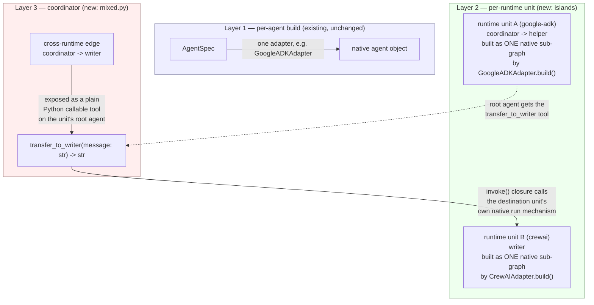

# Mixed-target spawning — design

Status: **v1 shipped** (foundation). Tracks [issue #9](https://github.com/Mehul-Gupta-SMH/CommonADK/issues/9),
`ROADMAP.md` ("Planned") and `plan.md` ("Deferred / roadmap").

This document covers the in-process case only: several agents in one
project, each instantiated on its own SDK, coordinated locally, in one
Python process, with no network hop. It does **not** cover remote/networked
agents or A2A — see "Out of scope" below for exactly where that would
attach later.

## The problem

Every adapter in this codebase answers one question — "build this whole
`interactions.yaml` graph under one SDK" — and answers it well (see
`docs/HLD.md`, "Comparing the six targets"). But a project is not always
best served by one SDK for every agent. A team might want the Claude Agent
SDK's subagent ergonomics for a coding-heavy agent and CrewAI's crew
structure for a research team in the same project, or might be migrating
one agent at a time between two SDKs and need both live simultaneously.
`agent-config.yaml` has reserved a per-agent `runtime:` key for exactly this
since M1 (`models.py`), but v1 through M8 left it unhonored by design
(`plan.md`, "v1 constraint: one target per build") — every agent built
under the single `target=` string passed to `project.build()`, and setting
`runtime:` only produced a warning.

This milestone makes `runtime:` real for the **in-process** case: it does
not add a wire protocol between SDKs, does not let a `commonadk`-built agent
call out to a process running somewhere else, and does not change what any
existing single-target project does. It answers "how do several
already-installed SDKs, running in the same Python process, hand work to
each other" — nothing more.

## What `runtime:` means now

`AgentConfig.runtime` (`models.py`) is each agent's own SDK pin. Its
*effective* runtime is resolved the same way `resolve_model` resolves a
model: the agent's own `runtime:` if set, else the target passed to the
build call —

```python
effective_runtime = agent.config.runtime or default_target
```

(`Project.effective_runtime`, `models.py`). `project.build(agent, target=)`
is completely unaffected — it never reads `runtime:` at all, so a project
that sets no agent's `runtime:` behaves identically to every version of
commonadk before this one. `runtime:` only starts mattering when a caller
uses the new `project.build_mixed(agent, default_target)` entry point
below.

**Validation** (`validation.py`, `_check_runtime`) now does real work
instead of warning:

- an agent's `runtime:` naming a target `commonadk.adapters` doesn't
  register at all → a load-time error listing the known targets (mirrors
  `get_adapter`'s unknown-target `ValueError` text, checked against
  `adapters.known_targets()` — a name-only list, no SDK import required, so
  this half of the check costs nothing extra for a project that never sets
  `runtime:`);
- an agent's `runtime:` naming a *registered* target whose SDK package
  isn't installed → the exact `pip install "commonadk[<extra>]"` install
  hint `get_adapter` already produces for a missing SDK, reused verbatim
  (`_check_runtime` calls `get_adapter(cfg.runtime)` itself and folds the
  `ImportError` text into the error list, prefixed with the agent name).

The second check is the one deliberate, scoped exception to "the core stays
SDK-free" (`ROADMAP.md`, "Principles that carry forward"): *if and only if*
some agent explicitly sets `runtime:`, `commonadk.load()` now attempts to
import that one target's SDK, to fail as loudly at load time as `build()`
would fail later. A project that sets no agent's `runtime:` — every shipped
example before this milestone, and the compatibility baseline this
milestone must not disturb — imports no SDK at load time, exactly as before
(`test_no_runtime_check_imports_sdk_when_unset` in `tests/test_mixed.py`
pins this).

## The three-layer model



1. **Per-agent build.** Unchanged: `AgentSpec` → one native SDK object, via
   the existing six adapters (`adapters/*.py`). Nothing here is touched by
   this milestone — every adapter is reused exactly as it stood at 126
   tests passing.
2. **Per-runtime unit ("island").** A maximal set of agents that (a) share
   an effective runtime and (b) are connected to each other by
   `interactions.yaml` edges *between agents of that same runtime*. Each
   island is hollow to the layer above it: `mixed.py` builds it by handing
   its own adapter a **filtered `Project`** — same `agents` dict, but
   `graph.edges` restricted to edges whose both endpoints are in the island
   — so the adapter does exactly what it already does for a single-target
   `build()`: walk `interactions.yaml`, build a real sub_agents tree /
   handoffs list / Swarm / crew / compiled graph / flat subagent registry,
   whichever its SDK natively supports. **Within an island you get true
   native wiring** — an ADK sub_agents tree stays a sub_agents tree, a
   LangGraph handoff tool stays a per-edge handoff tool. Only edges that
   *leave* an island are the coordinator's problem.
3. **Coordinator.** Handles exactly the edges layer 2 filtered out — edges
   whose two endpoints resolve to different effective runtimes. For each
   one, it exposes a plain Python callable "transfer to `<destination>`"
   tool on the edge's source agent, using the same "every SDK wraps plain
   typed functions into tools" mechanism every adapter already relies on
   for `tools.py` (`plan.md`, "core insight" — see `_make_transfer_func` in
   `mixed.py`). Calling that tool invokes the destination island's own
   native run mechanism (`InMemoryRunner`/`Runner.run_sync`/`query`/
   `Crew.kickoff`/`Swarm.run`/`graph.invoke` — the same six functions
   `cli.py`'s `_run_*` helpers already use for `commonadk run`, reused
   here for exactly the same purpose: turn a live built object plus a text
   prompt into a text response) and returns its final text answer as the
   tool's result. There is no separate coordinator *object* — the
   coordinator is the set of closures `mixed.py` wires onto each
   cross-runtime edge's source agent at build time.

## Island computation

Implemented in `mixed.py`'s `_compute_islands`. Inputs: the project, the
set of agents reachable from the build root over *every* edge (intra- and
cross-runtime — the same "how far does this build actually reach" question
`BaseAdapter._reachable_agents` answers for a single-target build, computed
the same way in `mixed._reachable_all_edges`), and each agent's effective
runtime.

1. Build the **intra-runtime edge set**: every `interactions.yaml` edge
   whose `from` and `to` both resolve to the same effective runtime and are
   both in the reachable set.
2. Union-find over the reachable agents using only those edges, treated as
   **undirected** for grouping purposes (a delegates-to relationship groups
   two same-runtime agents into one island regardless of edge direction).
   Each resulting group is one island. Note this is exactly equivalent to
   "connected component of the same-runtime subgraph" — and it also proves
   a cross-runtime edge can never accidentally sit *inside* an island:
   `runtime(from) == runtime(to)` is the group-membership condition, so two
   agents joined by a cross-runtime edge are, by construction, never grouped
   by it (cross-runtime edges are exactly the edges connecting two
   *different* islands).
3. **Pick each island's root**, the one agent `mixed.py` hands to that
   island's adapter as the `agent_name` to build from (adapters only know
   how to walk forward from one root — `_reachable_agents` follows directed
   edges). A candidate root must reach every other island member using only
   *directed*, intra-island edges (a plain BFS/DFS check per candidate).
   `_pick_root` prefers the overall `build_mixed` entry agent when it
   qualifies for its own island (the common case — a coordinator with no
   incoming edges trivially reaches everything under it), else falls back
   to the lexicographically-first qualifying agent, for a deterministic
   choice.
   If **no** agent in an island reaches every other member — the island's
   internal edges don't all point the same direction, e.g. two independent
   entry points into the same runtime — `mixed.py` raises a clear
   `ValueError` naming the island's members rather than silently building
   only part of it. This is a real, documented v1 limitation: multi-root
   islands need either restructuring the edges (so one member reaches the
   rest) or moving one of the members to its own `runtime:` so it becomes
   its own island.
4. Build each island via `get_adapter(runtime).build(filtered_project,
   root)`, exactly the existing single-target build path, and record it as
   a `RuntimeUnit(runtime, root, members, native)`.

## Cross-runtime edges — exactly how they behave in-process

A cross-runtime edge `A -> B` (`runtime(A) != runtime(B)`) is **not** passed
to either agent's adapter — it never appears in either island's filtered
`graph.edges`. Instead:

1. **v1 scope: the edge's source must be its island's root.** `mixed.py`
   only has direct, generically-reachable access to the *one* native object
   an adapter's `build()` returns — the island root. Reaching a specific
   non-root member's live agent object inside that returned tree/list/crew/
   graph would need adapter-specific traversal this milestone does not add
   (Claude Agent SDK's flat `options.agents` dict is the one adapter here
   where that traversal would be nearly free — a documented, easy v2
   extension, not attempted in v1). A cross-runtime edge sourced anywhere
   else in an island raises a clear `ValueError` naming the agent, the
   island's actual root, and the constraint.
2. **The bridge is a plain Python callable**, built by `_make_transfer_func`
   — `def transfer_to_<destination>(message: str) -> str`, with a real
   docstring — exactly the shape every `tools.py` function in this project
   already has to be. This is deliberate: the project's core insight is
   that every one of the six SDKs already knows how to turn a plain typed
   function into a tool, so the bridge needs no new per-SDK protocol, only
   the *source* adapter's existing tool-wrapping path, invoked one extra
   time after the island is already built.
3. **Attaching it is per-runtime**, because "add one more tool to an
   already-built root agent" is not the same operation on every SDK — see
   "Supported/unsupported cross-runtime source targets" below for exactly
   what was verified, against what, and why the other two targets are
   excluded rather than guessed at.
4. **Invoking it** runs the destination island's own native execution path
   with the message as the prompt and returns its final text — the same
   `project`/`prompt` → `str` shape `cli.py`'s `_run_*` functions already
   implement per target, reused here (`mixed._INVOKERS`) against the
   already-built native object instead of rebuilding it. This is a **new
   conversation turn** into the destination island each time the tool is
   called, not a live shared object graph or shared memory — the source
   agent's model sees only the tool's text return value, same as it would
   see any other tool's result. Concretely, calling
   `transfer_to_writer("please write up: ...")` on a `google-adk`
   coordinator, where `writer` is a `crewai` island, runs
   `InMemoryRunner`-side tool-call handling → the plain Python function →
   `Crew.kickoff()` on the already-built writer crew, synchronously, and
   the crew's final `.raw` string comes back as the tool's result.
5. **State does not cross the boundary automatically.** Everything the
   destination needs must be in the message text the source's model
   chooses to pass — there is no shared session, memory, or state object
   between two different SDKs' runtimes in v1 (`plan.md`'s "richer edge
   semantics — shared state" is explicitly a separate, later deferred
   item, issue #10, and stays deferred here too).

## Supported/unsupported cross-runtime source targets

Verified directly against every installed SDK in this environment (not
assumed) — see the shell transcript this design was written against, and
each claim's home in `mixed.py`'s own comments:

| Target | Source-capable in v1? | Evidence |
|---|---|---|
| `google-adk` | **Yes** | `google.adk.agents.Agent` is a `pydantic.BaseModel` (`extra="forbid"`, no `frozen`); `Agent(...).tools` is a plain `list`, and appending a new plain callable to it after construction works (`a.tools.append(bar)` verified directly against `google-adk`) — ADK's own tool-wrapping happens lazily off this list, not at `Agent.__init__`. |
| `openai` | **Yes** | `agents.Agent` is a real Python `dataclass` (`dataclasses.is_dataclass(Agent)` is `True`); the adapter's own code already mutates `.handoffs` post-construction (`openai_agents.py`, `_get_or_build`), and `.tools.append(function_tool(func))` was verified directly to work the same way. |
| `crewai` | **Yes, with one graph-shape caveat** | `crewai.Agent.tools` is a plain `list`, appendable with `crewai.tools.tool(func)`-wrapped callables (verified directly). The caveat is CrewAI's own constraint, already documented in `crewai_adapter.py`: a **hierarchical manager cannot hold tools** (`Crew._create_manager_agent` raises at `kickoff()` if it does). So a cross-runtime edge sourced at a `crewai` island root that is *also* that island's manager (i.e. it has intra-island delegates too) is rejected with a clear error naming the agent and the constraint — sourced at a root with no intra-island children (the sequential solo-member shape), it works. |
| `claude` | **Yes** | Both `ClaudeAgentOptions` and `AgentDefinition` are real `dataclasses` (verified via `dataclasses.is_dataclass`); `options.mcp_servers` (a `dict`) accepts a new key and `options.allowed_tools` (a `list`) accepts an appended tool name after construction, verified directly. The bridge is registered as one more in-process MCP server (`create_sdk_mcp_server`) exactly like every one of the island's own agents already gets one, per `claude_agent.py`'s own tool-wiring approach. |
| `autogen` | **No — verified unsupported, not guessed** | `AssistantAgent.__init__` only accepts `tools=` at construction; the *wrapped* tool list lives on a private, undocumented `_tools` attribute (confirmed by direct introspection: `dir(AssistantAgent_instance)` shows `_tools`, not `tools`). Appending to `_tools` directly *does* work mechanically (verified), but this project will not build a documented feature on an SDK's private, unversioned attribute — the same restraint every adapter in this codebase already shows toward "trusting a table it doesn't know" (`autogen_adapter.py`'s own model-routing docstring). If `autogen-agentchat` ships a public tool-attachment API in a later version, this is a natural v2 extension. |
| `langgraph` | **No — verified unsupported, not guessed** | `LangGraphAdapter.build()` calls `builder.compile()` once, at the end of one `build()` call, and returns the resulting `CompiledStateGraph` — there is no hook between "graph assembled" and "graph compiled" for `mixed.py` to reach in from the outside without changing the adapter itself (which the brief for this milestone rules out: adapters are reused unchanged). A compiled graph's nodes are not individually mutable the way a `dataclass`'s fields are. Supporting this target as a cross-runtime source would need either a new adapter method (e.g. `build_with_extra_tools`) or rebuilding the whole island with the bridge tool included from the start — both are real, buildable v2 work, not attempted here. |

**Destination support is universal — all six targets**, because invoking a
destination only needs the object `build()` already returns plus that
SDK's own "run this" entry point, which every adapter's `build()` result
already has (`mixed._INVOKERS`, mirroring `cli.py`'s six `_run_*`
functions exactly). A `langgraph` or `autogen` island can be the *target*
of a cross-runtime edge from `google-adk`/`openai`/`crewai`/`claude`; it
just cannot itself be the *source* of one in v1.

## Env preflight across runtimes

`build_mixed` runs one preflight pass, before building any island, over
every agent in the overall build's reachable set (all runtimes at once) —
`mixed._check_env_all` calls the same `Project.check_env(name)` primitive
`BaseAdapter._check_env` already calls per agent (`adapters/base.py`), just
looped across the whole cross-runtime reachable set instead of one target's
sub-graph, and folds every missing variable from every runtime into one
`OSError` (mirroring the project's "collect every problem, fail once"
philosophy — `validation.py`'s own doctring, applied here to a build-time
check). Each island's own adapter still runs its own `_check_env` too, when
`get_adapter(runtime).build(...)` is called for that island — redundant
with the pass above for agents already covered, but harmless, and it keeps
every adapter's existing contract ("fail loudly, up front, if any reachable
agent is missing a required env var") intact unchanged.

## Failure modes and their error messages

| Failure | Raised by | Message shape |
|---|---|---|
| Unknown `runtime:` name | `validation._check_runtime` (load time) | `"<agent>: unknown runtime '<name>'. Known targets: [...]"` |
| `runtime:` names a real target, SDK not installed | `validation._check_runtime` (load time) | `"<agent>: target '<name>' requires its SDK to be installed. Install it with: pip install \"commonadk[<extra>]\" (...)"` — `get_adapter`'s own text, prefixed with the agent name |
| Missing required env var, any runtime | `mixed._check_env_all` (`build_mixed` time, before any island is built) | one `OSError` listing every missing var across every runtime, `- <agent> [<runtime>]: <VAR> (<description>)` per line |
| Island has no single agent that reaches every other member | `mixed._pick_root` | `ValueError` naming the island's members and the fix (restructure edges, or split the island via `runtime:`) |
| Cross-runtime edge sourced at a non-root island member | `mixed.build_mixed` | `ValueError` naming the edge, the actual source, and the island's real root |
| Cross-runtime edge sourced at an `autogen`/`langgraph` agent | `mixed._unsupported_source_error` | `ValueError` naming the agent, its runtime, and the specific SDK-level reason (see the evidence table above) — never a silent no-op |
| Cross-runtime edge sourced at a `crewai` hierarchical manager | `mixed._attach_crewai` | `ValueError` naming the agent and CrewAI's "manager cannot hold tools" constraint |
| Same-runtime graph shape errors (a Google ADK cycle, an unsupported model provider, ...) | unchanged | Each island still goes through its own adapter's existing, unmodified error paths — `mixed.py` adds no new failure mode *inside* an island |

## Out of scope: remote/networked agents, A2A

Nothing in this milestone opens a socket, a subprocess boundary, or any
transport. `mixed.py`'s coordinator calls Python functions in the same
process and same memory space — the "invoke" step for a `crewai`
destination is a direct `Crew.kickoff()` call, not an RPC. This is the line
`plan.md` always drew between "mixed-target spawning" and "a wire protocol
between frameworks": this milestone implements the former only.

Where A2A (or any other agent-to-agent wire protocol) would attach later,
concretely:

- **A new kind of `RuntimeUnit`.** Today every `RuntimeUnit.native` is a
  live, in-process SDK object. A remote unit would carry a client/endpoint
  reference instead — `mixed.py`'s `RuntimeUnit` dataclass already
  separates "how this unit is invoked" (`_INVOKERS[runtime]`) from "what it
  is" (`native`), so a remote unit only needs a new invoker function that
  speaks A2A instead of calling `.kickoff()`/`.invoke()`/`query()`
  directly — no change to island computation or to the source-side bridge
  mechanism.
- **A new "expose remote agent" adapter path**, per `docs/HLD.md`'s
  existing "Extension points" section: an adapter would gain a method that
  wraps *itself* behind an A2A server (exposing one island's root as a
  callable remote agent) so a *different process* running a different
  commonadk project — or a non-commonadk A2A client entirely — could reach
  it. `_attach_bridge`'s source-side callable-tool mechanism stays the same
  shape either way; only what's on the other end of the call changes.
- **Cross-runtime edges stay agnostic.** `interactions.yaml` already never
  encodes SDK-specific mechanics (`plan.md`, "Design implications honored
  in v1") — a cross-runtime edge today resolves to an in-process function
  call; the same edge, unchanged in `interactions.yaml`, would resolve to
  an A2A call once a remote unit exists on one side of it. No project
  author's `common/` folder needs to change shape when that lands.

## What changed, file by file

- `models.py` — `Project.effective_runtime`, `Project.build_mixed` (a thin
  delegate to `mixed.build_mixed`, mirroring how `build` delegates to
  `adapters.get_adapter`); `AgentConfig.runtime`'s docstring updated (no
  longer "reserved, unused").
- `validation.py` — `_check_runtime` rewritten: real errors instead of a
  blanket warning (see "What `runtime:` means now" above).
- `adapters/__init__.py` — `known_targets()`, a zero-cost (no SDK import)
  helper so `validation.py` can check a `runtime:` name against the
  registry without duplicating `_REGISTRY`.
- `mixed.py` — new module: `RuntimeUnit`, `MixedSystem`, `build_mixed`, the
  island algorithm, the per-runtime attach/invoke tables. No existing
  adapter, and no line of `models.py`'s or `validation.py`'s *existing*
  logic, is modified beyond the two additions above.
- `tests/test_mixed.py` — new, `importorskip`-gated per target like every
  existing adapter test file.
- `examples/mixed-crew/` — a small two-runtime fixture project (does not
  touch `examples/research-crew/`).
