# CommonADK — Execution & Telemetry Design (`runners/`)

Audience: same as `HLD.md`/`LLD.md` — someone deciding whether to adopt the
runner layer, or extending it to one of the four SDKs it doesn't cover yet.
This doc is written **before** `src/commonadk/runners/` and drives its
implementation — where the code and this doc disagree, the code has a bug.

## Why a separate layer from `adapters/`

`adapters/*.py` (issue #6 era, M2–M8) answer "what does a live agent object
for SDK X look like" — a **build-time** question, answered once per
`project.build(agent, target=...)` call. Running that object — sending it a
prompt, getting a stream of steps back, knowing what it cost — is a
completely different question with a completely different shape per SDK:
one is an async generator of `Event` pydantic models, another is an
async-iterable "stream events" protocol with a `RunResultStreaming` at the
end, a third is a subprocess-driven message stream with a `ResultMessage`
carrying cost the SDK computed for you. `commonadk run` today
(`cli.py`'s six `_run_*` functions) papers over all of that by grabbing the
final text and throwing everything else away.

`runners/` is the **run-time** counterpart to `adapters/`, with the same
registry shape (see "Registry" below) but normalizing *execution*, not
*construction*: every SDK's native run surface is mapped onto one small set
of events, so a caller gets one step trace, one token/cost story (honest
about its gaps), one hook mechanism, and one session model — regardless of
which of the six SDKs is underneath. `adapters/` and `runners/` are
deliberately separate modules with separate registries: building an agent
never requires knowing how you'll run it, and running one never touches
`adapters/`'s construction logic beyond calling `project.build(...)`, which
every runner does exactly once, unmodified, at the top of `run()`.

## The normalized event model (`events.py`)

Eight frozen, `kw_only` dataclasses, every one carrying a process-wide
monotonic `seq: int` (assigned via `itertools.count`, never reused, never
reset — the only field a caller should sort by; two events can share a
`ts` at second/sub-second resolution) and a wall-clock `ts: float =
time.time()`. Every event also carries `run_id: str`, so events from two
concurrent `run()` calls (e.g. two turns of the same `RunSession`, or two
different agents) interleave in a hook stream without ambiguity.

| Event | Fields (beyond seq/ts/run_id) | Why it exists |
|---|---|---|
| `RunStarted` | `target`, `agent_name`, `prompt`, `session_id` | Marks the start of exactly one `run()` call — the unit `--trace` and a `RunSession` turn both key off. |
| `AgentStarted` | `agent_name` | A specific agent (root or a delegate/handoff target) began producing output. Multi-agent SDKs emit more than one pair of these per run. |
| `AgentFinished` | `agent_name`, `output_summary` | Closes the `AgentStarted` for the same name. Always emitted in `finally`-equivalent order even on error (see "Hook contract" — but note `RunError` replaces the *trailing* `AgentFinished`/`RunFinished` on a hard failure, see below). |
| `LLMCall` | `agent_name`, `model`, `prompt_tokens`, `completion_tokens`, `total_tokens`, `cost_usd`, `duration_ms` — **all five of the last group `Optional`, default `None`** | The one event every cost/usage rollup is built from. `None` means "this SDK did not report it for this call" — see "The None-vs-0 rule" below, the single most load-bearing rule in this design. |
| `ToolCall` | `agent_name`, `tool_name`, `arguments`, `result_summary`, `duration_ms`, `error` | One per tool invocation the underlying SDK actually reports as a discrete step (not every SDK gives us pre/post pairs — see per-SDK notes). |
| `Transfer` | `from_agent`, `to_agent`, `transfer_kind` | One agent routed work to another — the same "edge" concept `interactions.yaml`/the adapters already model, but observed at run time. `transfer_kind` is a short label naming the *native* mechanism observed (e.g. `"google-adk:transfer_to_agent"`, `"openai-agents:handoff"`), not commonadk's own `delegate`/`handoff` vocabulary — no adapter distinguishes those at build time either (see `HLD.md`, "v1 edge-semantics intersection"), so a runner has no ground truth to map onto that distinction and doesn't invent one. |
| `RunFinished` | `final_text`, `total_prompt_tokens`, `total_completion_tokens`, `total_tokens`, `total_cost_usd`, `duration_ms`, `usage_complete` | The terminal, successful event — its totals are `Trace.rollup()`'s `llm_calls` block, copied onto the event itself so a `--stream` consumer sees the final numbers without re-deriving them. |
| `RunError` | `message`, `error_type` | The terminal, failed event. A `run()` call ends in **either** `RunFinished` **or** `RunError`, never both, never neither — see `BaseRunner.run`'s docstring contract. |

`Event.to_dict()` adds a `"type"` key from each subclass's `kind: ClassVar[str]`
(`"run_started"`, `"llm_call"`, ...); `events.event_from_dict()` is the
exact inverse, so `Trace.to_json()` / `Trace.from_json()` round-trip losslessly
(`tests/test_runners.py::test_event_json_round_trip`).

### The `None`-vs-`0` rule

Every token/cost/duration field defaults to `None` and a runner **never**
substitutes `0` or an estimate for a value its SDK didn't hand back. This
matters concretely: Google ADK's `Event.usage_metadata` (a
`LlmResponse` field, `google/adk/models/llm_response.py:112`) is itself
`Optional[...]` and is only set on events that actually carry a model
response — a runner that defaulted missing usage to `0` would make a crew
that burned 50K tokens look identical, in the JSON trace, to one that used
none at all. `Trace.rollup()` enforces this at the aggregate level too:
summing is a strict yes/no over each call's field being non-`None`, and a
run where any `LLMCall` is missing usage is marked `"usage_complete":
false` with a `note` explaining exactly what's missing — see "Trace and
rollups" below.

## Registry (`runners/__init__.py`)

Mirrors `adapters/__init__.py`'s `_REGISTRY`/`get_adapter` shape on purpose
— same two-mode error contract a caller already knows from the adapter
side:

```python
_REGISTRY = {
    "google-adk": ("commonadk.runners.google_adk", "GoogleADKRunner", "google"),
    "openai": ("commonadk.runners.openai_agents", "OpenAIAgentsRunner", "openai"),
}
_UNPORTED_TARGETS = {"claude", "crewai", "autogen", "langgraph"}
```

`get_runner(target)` raises:
1. `ValueError` naming known targets — `target` isn't a real adapter target
   at all (mirrors `adapters.get_adapter`'s first error mode).
2. `NotImplementedError` with a specific "not yet available, see
   runner-design.md" message — `target` is a real, buildable adapter target
   (in `_UNPORTED_TARGETS`) that simply has no *runner* yet. This is a new
   third mode `adapters/__init__.py` doesn't need, because every adapter
   target has always had an adapter; not every adapter target has a runner
   yet.
3. `ImportError` with the same `pip install "commonadk[<extra>]"` hint —
   `target` has a runner registered but the SDK isn't installed.

`known_targets()` (ported) and `known_unported_targets()` (documented, not
yet built) are both plain, SDK-import-free lookups — exactly like
`adapters.known_targets()` — so the CLI can decide which message to print
without importing anything.

## Per-SDK mapping — the implemented runners

All four verified directly against the **installed** packages, not memory —
every class and file path below was read during this work.

### Google ADK (`runners/google_adk.py`) — google-adk 2.7.1

| Native surface (file : line) | Normalized as |
|---|---|
| `google.adk.runners.Runner.run_async` / `InMemoryRunner` (`google/adk/runners.py:1131`, `:2443`) | The whole run loop this runner drives — `async for event in runner.run_async(...)`. |
| `Event.author` (`google/adk/events/event.py:109`) | Tracked as `current_author`; a change in `author` between consecutive events closes the previous `AgentStarted` with an `AgentFinished` and opens a new pair. **Heuristic, not an SDK-native lifecycle boundary** — ADK's `Event` stream has no explicit "agent X finished" event; author-change is the only signal available, and a single agent's own multi-step tool-calling loop never changes `author`, so it stays inside one `AgentStarted`/`AgentFinished` pair, which is the intended granularity. |
| `Event.get_function_calls()` / `.get_function_responses()` (`llm_response.py:169`, `:178`, returning `google.genai.types.FunctionCall`/`FunctionResponse`) | `ToolCall`. A call and its response are **separate `Event`s**; this runner keys a `pending_calls` dict by `FunctionCall.id` (falling back to `.name`) to pair them and compute `duration_ms` as *our own* wall-clock delta between observing the two events (ADK does not timestamp the call itself — `Event.timestamp` is the event's own emission time, not the tool's). `error` is populated when the function response dict carries an `"error"` key (a convention, not a typed field — ADK's `FunctionResponse.response` is `dict[str, Any] | None`). |
| `EventActions.transfer_to_agent` (`google/adk/events/event_actions.py:122`) | `Transfer(transfer_kind="google-adk:transfer_to_agent")` — this is the one mechanism both `delegate` and `handoff` edges compile to (`adapters/google_adk.py`'s own docstring). |
| `Event.usage_metadata` → `google.genai.types.GenerateContentResponseUsageMetadata` (`prompt_token_count`, `candidates_token_count`, `total_token_count`) | `LLMCall`. Emitted once per `Event` that carries non-`None` `usage_metadata` — in ADK's function-calling loop this is once per actual model turn (a turn that only returns function calls still gets its own usage-bearing event), so a multi-step tool-calling exchange naturally produces multiple `LLMCall`s, not one. |
| `LlmResponse.error_code` / `.error_message` (`llm_response.py:93,96`) | `RunError` (non-fatal — emitted inline, the run keeps going; ADK itself keeps iterating after a per-turn error in some cases, e.g. a blocked response that the agent can retry). This is **not** the fatal `RunError` that ends a `run()` call — see "Fatal vs. inline `RunError`" below. |
| `Event.is_final_response()` + `Event.content.parts[*].text` (`event.py:288`) | Accumulated into `RunFinished.final_text` — identical logic to today's `cli.py::_run_google_adk`, moved here unchanged. |
| **Not available**: per-LLM-call duration, per-agent thinking/reasoning tokens beyond `usage_metadata`'s own fields, request/transport IDs. | `LLMCall.duration_ms` is always `None` for this runner — nothing in `Event`/`LlmResponse` timestamps an individual model call boundary (only the `Event`'s own emission `timestamp`, which conflates model latency with everything ADK does around it). Documented, not guessed. |

**Session/multi-turn**: `RunSession.native["google-adk"]` holds `{"runner":
InMemoryRunner, "user_id": str, "adk_session_id": str}`. First turn creates
all three (via `session_service.create_session`); every later turn on the
same `RunSession` reuses the **same** `InMemoryRunner` (bound to the agent
built on the *first* turn) and the same ADK session id, so ADK's own
session service accumulates history exactly as `InMemoryRunner` is
designed to. A fresh `RunSession()` (or `session=None`) always starts a new
ADK session — no cross-conversation bleed.

### OpenAI Agents SDK (`runners/openai_agents.py`) — openai-agents 0.21.1

| Native surface (file : line) | Normalized as |
|---|---|
| `agents.Runner.run_streamed` (`agents/run.py:444`) returning `RunResultStreaming`, consumed via `async for e in result.stream_events()` (`agents/result.py:882`) | The run loop this runner drives. |
| `AgentUpdatedStreamEvent.new_agent` (`agents/stream_events.py:52`) | Closes/opens `AgentStarted`/`AgentFinished` on a name change, same pattern as ADK's author-change heuristic — this one IS an explicit SDK signal (the SDK fires this event specifically when the active agent changes), unlike ADK's inferred one. |
| `RunItemStreamEvent(name="tool_called")` wrapping a `ToolCallItem` (`agents/items.py:390`, `.tool_name`/`.call_id` properties) | Opens a pending `ToolCall`, keyed by `.call_id` (falling back to `id(item)` if absent — verified some raw tool-call shapes are plain `dict`s without a `call_id`). `arguments` parsed from `raw_item.arguments` (a JSON string on `ResponseFunctionToolCall`) via `json.loads`, falling back to `{"_raw": <string>}` if it isn't valid JSON (never silently dropped). |
| `RunItemStreamEvent(name="tool_output")` wrapping a `ToolCallOutputItem` (`agents/items.py:438`, `.output`) | Closes the pending `ToolCall` matched by call id; `duration_ms` is this runner's own wall-clock delta between the two stream events (same caveat as ADK: the SDK doesn't timestamp tool execution itself). |
| `RunItemStreamEvent(name="handoff_occured")` wrapping a `HandoffOutputItem` (`agents/items.py:317`, `.source_agent`/`.target_agent`) | `Transfer(transfer_kind="openai-agents:handoff")` — note the SDK's own field/event name is misspelled (`"handoff_occured"`, `agents/stream_events.py:34`, with a code comment explaining it's kept for backward compatibility) — the raw string, not a fixed typo, is what this runner switches on. |
| `RunResultStreaming.raw_responses: list[ModelResponse]` (`agents/items.py:713`), each with `.usage: Usage` (`agents/usage.py:196`) | `LLMCall`, one per `ModelResponse`, emitted **after** the stream fully drains (not incrementally — see "Not available" below for why). Whether usage was actually reported is decided from `Usage`'s own token fields (`input_tokens`/`output_tokens`/`total_tokens`, all nonzero-checked) since `Usage`'s token fields default to plain `int = 0`, not `None`, and — corrected after a live run — `Usage.requests` alone is **not** a safe "did it report usage" signal; see "OpenAI Agents' `0`-not-`None` wrinkle" below. |
| **Not available (v1, documented gap)**: which agent produced which `ModelResponse`. | `ModelResponse` (`agents/items.py:713`) has no agent-identifying field — confirmed by reading its full field list (`output`, `usage`, `response_id`, `request_id`, `raw_usage`). When a run involves exactly one agent (no `handoff_occured` observed), every `LLMCall.agent_name` is that agent's name — precise. When a run spans a handoff, this runner sets `LLMCall.agent_name = None` for every call in that run rather than guessing which of the participating agents made which call — the per-agent rollup in `Trace.rollup()` simply excludes `agent_name=None` calls from any agent's bucket while still counting them in the run-wide total. A future version could attempt finer attribution by counting `RunItemStreamEvent`s between agent changes, but that requires assuming a 1:1 item-count-to-call-count relationship this investigation did not verify against the installed SDK and is not asserted here. |
| **Not available**: per-call duration. | `ModelResponse` carries no timing field either — `LLMCall.duration_ms` is always `None` here too. |
| `raw_response_event` (`RawResponsesStreamEvent`, wrapping the OpenAI Responses API's own low-level delta events) | **Not mapped in v1.** These are the individual token-level streaming deltas underneath a single `ModelResponse` (content deltas, response-lifecycle markers). Mapping them would let `--stream` show token-by-token output, but there's no normalized event in this model for "partial text delta" (`plan.md`/this doc's "Out of scope" explicitly defers streaming-token granularity) — a runner that tried would need a new event type, not a reinterpretation of `LLMCall`/`ToolCall`. This runner explicitly skips (`continue`s past) every `raw_response_event`. |
| `RunItemStreamEvent(name="message_output_created"|"reasoning_item_created"|"mcp_*"|...)` | **Not mapped.** These carry the model's own text/reasoning/MCP-protocol bookkeeping, already reflected in `RunFinished.final_text` (from `result.final_output`) and not distinct "steps" in the normalized model's vocabulary. |

**OpenAI Agents' `0`-not-`None` wrinkle (corrected after issue #8's first
live run)**: unlike Google ADK's
`Optional[GenerateContentResponseUsageMetadata]`, `agents.usage.Usage`'s
`input_tokens`/`output_tokens`/`total_tokens` fields (`agents/usage.py:196`)
are plain `int`, defaulting to `0` — there is no SDK-native way to ask "was
usage reported for this call" from the token fields alone.

The first live run (model `claude-haiku-4-5`, routed through this target's
LiteLLM bridge) exposed a bug in this runner's original heuristic, which
read `Usage.requests > 0` as "usage reported." That does **not** hold:
verified directly against the installed `agents` 0.21.1 package,
`agents/run_internal/run_loop.py` (around the `ModelResponse` construction
that feeds `RunResultStreaming.raw_responses`) builds
`Usage(requests=_requests_for_response_without_usage(terminal_response))`
whenever `terminal_response.usage` is `None` — i.e. whenever the *provider*
never sent back a usage payload at all. `_requests_for_response_without_usage`
(`agents/usage.py`) returns `1` here because
`agents/models/chatcmpl_stream_handler.py`'s `_mark_request_completed_without_usage`
marked the response as "the request completed, so it counts, even though
the provider reported no usage" (`agents/extensions/models/litellm_model.py`
does the same on its non-streaming path, with an explicit
`logger.warning("No usage information returned from Litellm")` next to it).
The result is a `Usage` object with `requests=1` and every token field at
its `int` default of `0` — structurally the *same shape* `requests > 0`
was supposed to treat as "reported." Reconstructing that exact object
against the installed SDK (`Usage(requests=1)`) and running it through the
old code confirms the old heuristic returns `reported=True` for it, which
is precisely how the live run produced `0 tokens`, `$0.000000` for a turn
that had genuinely succeeded.

The fix: `reported` is now decided from the token fields themselves —
`bool(usage.input_tokens or usage.output_tokens or usage.total_tokens)` —
never from `Usage.requests`. Only when at least one token field is nonzero
are the int fields copied onto `LLMCall` (still verbatim ints, never
re-defaulted to `None` after that check passes); otherwise every one of
`LLMCall`'s token/cost fields is `None`.

**Is a genuine all-zero usage distinguishable from an unreported one?**
No — not from the public `Usage` object this runner has access to. A
provider-side `_mark_request_completed_without_usage` response and a
(hypothetical) real response that legitimately used exactly zero input and
output tokens produce an *identical* `Usage(requests=1, input_tokens=0,
output_tokens=0, total_tokens=0, ...)` — there is no additional field on
`Usage`, `ModelResponse`, or anywhere in `RunResultStreaming.raw_responses`
that carries the private "completed without usage" marker
(`_agents_sdk_request_completed_without_usage`, an attribute the SDK
attaches to its internal `Response` object, not to the `Usage`/
`ModelResponse` this runner ever sees). Since a real completed LLM call
reporting literally zero prompt tokens is not a case any provider this
project targets actually produces, this runner takes the conservative
reading per this project's own founding rule: an all-zero `Usage` is
treated as **unreported** (`None`), not as a confident zero. `Usage.requests`
is no longer read at all for this decision — it was the source of the bug,
not a fallback for it.

**Session/multi-turn**: `RunSession.native["openai"]` holds one
`agents.SQLiteSession` (`agents/memory/sqlite_session.py:42`, default
`db_path=":memory:"` — fully offline, no file needed), created once and
passed as `Runner.run_streamed(..., session=native_session)` on every turn.
Unlike Google ADK, the `Agent` object itself is *stateless* between turns —
conversation history lives entirely in the `Session`, so this runner
rebuilds the `Agent` fresh via `project.build(...)` on every call with no
correctness cost (the SDK's own documented pattern), rather than caching it
like the ADK runner caches its `InMemoryRunner`.

### AutoGen (`runners/autogen.py`) — autogen-agentchat/-core/-ext 0.7.5

| Native surface (file : line) | Normalized as |
|---|---|
| `TaskRunner.run_stream(task=, output_task_messages=False)` (`autogen_agentchat/base/_task.py:19`) over either a bare `AssistantAgent` or a `Swarm` — both implement the same protocol, so this runner never branches on which one `project.build(...)` returned (see `adapters/autogen_adapter.py`'s own docstring, "WHAT build() RETURNS"). `output_task_messages=False` keeps the echoed user-task message out of the stream entirely, so no message ever has `.source == "user"` to special-case. | The whole run loop this runner drives; the stream's final item is a `TaskResult` (`.messages`), used for `RunFinished.final_text` exactly like `cli.py`'s existing `_run_autogen`. |
| Every `BaseChatMessage`/`BaseAgentEvent.source: str` (`autogen_agentchat/messages.py:86,161`) | Tracked as `current_agent_name`; a change closes the previous `AgentStarted`/`AgentFinished` pair and opens a new one — genuinely per-message SDK-native attribution, not a heuristic (contrast ADK's author-change inference) and finer-grained than OpenAI Agents' `AgentUpdatedStreamEvent` (which only fires on an actual handoff, not on every message). |
| `ToolCallRequestEvent.content: List[FunctionCall]` / `ToolCallExecutionEvent.content: List[FunctionExecutionResult]` (`messages.py:445,490`) | `ToolCall`, paired by `FunctionCall.id` / `FunctionExecutionResult.call_id` in a `pending_calls` dict (same correlation pattern as both shipped runners); `duration_ms` is this runner's own wall-clock delta (AutoGen doesn't timestamp tool execution either). `error` comes from `FunctionExecutionResult.is_error: bool \| None`, a real typed field (unlike ADK's dict-convention `"error"` key). |
| `HandoffMessage.source` / `.target` (`messages.py:421`) | `Transfer(transfer_kind="autogen:handoff")` — a dedicated message type, no inference needed, the cleanest of the two targets this change ports. |
| Every message's own `.models_usage: RequestUsage \| None` (`messages.py:89,164`; `RequestUsage.prompt_tokens`/`.completion_tokens`, `autogen_core/models/_types.py`) | `LLMCall`, one per message with non-`None` `.models_usage` — verified against `autogen_agentchat/agents/_assistant_agent.py` that this is genuinely one per actual model round-trip (a direct `Response`, a `ToolCallRequestEvent`, or a post-reflection `Response`; the deterministic `ToolCallSummaryMessage` in between never carries usage), the finest per-call granularity of any target in this codebase. |
| **The `0`-not-`None` wrinkle, AutoGen edition** — verified directly, not assumed from the OpenAI Agents SDK precedent: `autogen_ext.models.openai._openai_client.py:710-712` defaults **both** `RequestUsage` fields to plain `0` (not `None`) whenever the provider's own response carries no usage at all — the exact bug shape this codebase already fixed once for OpenAI Agents (see above). This affects every AutoGen agent on the `openai/...` or `gemini/...` provider branch of `autogen_adapter.py` (both route through `OpenAIChatCompletionClient`). The `anthropic/...` branch (`_anthropic_client.py:685-688`) reads `result.usage.input_tokens`/`.output_tokens` straight from Anthropic's own API response, which always populates it — not affected in practice, but this runner can't tell which client produced a bare `RequestUsage`, so it applies the SAME check uniformly: `reported = bool(usage.prompt_tokens or usage.completion_tokens)`. An all-zero `RequestUsage` is `None` on every `LLMCall` token/cost field, never a confident zero. | Applied per `LLMCall` exactly like the OpenAI Agents SDK runner's own wrinkle. |
| **Per-agent model resolution** — a deliberate difference from `_resolved_model` in both shipped runners (which resolve once, using only the build root's name): since AutoGen attributes every message to its real producing agent, and a `Swarm`'s participants can each use a different model (the shipped example does: `coordinator`/`writer` on `fast`, `researcher` on `gemini/gemini-2.5-pro` directly), this runner resolves `model`/`cost_usd` **per message source**, memoized per `run()` call — more precise than either shipped runner needs to be, and made possible by AutoGen's finer attribution. | Prevents mispricing a non-root participant's calls under the root agent's model. |
| **Not available**: per-call duration (`RequestUsage` has no timing field); an inline, SDK-recovered run error the way ADK's `LlmResponse.error_code` is (nothing in the message stream signals a recovered mid-run error) — only the one fatal `RunError` from this runner's own `try/except`, same as the OpenAI Agents SDK runner. | Documented, not guessed. |

**Session/multi-turn**: `RunSession.native["autogen"]` holds `{"built": <the
`AssistantAgent`/`Swarm` `project.build()` returned>}`. `TaskRunner.
run_stream`'s own docstring states it "is stateful and a subsequent call
... will continue from where the previous call left off" — so this
runner's whole multi-turn story is build once, cache, and call
`.run_stream(task=prompt, ...)` again on turn 2+ against the SAME object,
mirroring how the Google ADK runner caches its bound `InMemoryRunner`. One
caveat verified only at the level stated: a `Swarm`'s `max_turns=
len(reachable)` (set by `autogen_adapter.py` at construction) is passed
into a freshly-constructed group-chat-manager on each `run_stream()` call
(`_base_group_chat.py:225`), which reads as a per-call budget rather than
one that depletes across the whole session — this was read from the
source, not independently reproduced with a live multi-turn run.

### LangGraph (`runners/langgraph.py`) — langgraph 1.2.11 / langchain 1.3.17

This target's event mapping was **not** derived from reading the SDK
source alone — this doc's own row for LangGraph (before this change)
flagged several specifics as "not yet confirmed against the installed
version" (which `stream_mode` surfaces tool calls; whether a `Command`
handoff is visible in the stream at all; whether a checkpointer can be
attached to the graph this codebase's adapter returns). All three were
resolved by constructing a real, offline `StateGraph` — using
`langchain_core.language_models.fake_chat_models.GenericFakeChatModel` in
place of a network-bound chat model, wired the same way
`langgraph_adapter.py`'s `create_agent` calls are — and reading the actual
stream chunks it produces. The corrections below replace, not extend, the
original row's guesses.

| Native surface (file : line) | Normalized as |
|---|---|
| `CompiledStateGraph.astream(input, stream_mode="values", subgraphs=True)` (`langgraph/graph/state.py`) | The whole run loop this runner drives, yielding `(namespace: tuple[str, ...], values: dict)` pairs. **Verified, not guessed**: for a leaf build (bare `create_agent(...)` graph, no outer `StateGraph`), `namespace` is always `()`. For a multi-agent build, `namespace` is `(f"{agent_name}:{uuid}",)` while a step executes inside that agent's own subgraph (a compiled graph used as a node is automatically a subgraph — LangGraph's own behavior), and reverts to `()` for the handful of values the outer graph observes directly (the first chunk; the instant a handoff's `Command(graph=Command.PARENT)` resolves; the final chunk). `namespace[0].split(":", 1)[0]` recovers the commonadk agent name — confirmed identical to the node name `langgraph_adapter.py` used in `builder.add_node(name, node)`. Never more than one segment deep: `create_agent`'s own internal model/tools nodes are plain node functions, not further nested compiled subgraphs. |
| `AIMessage.name` (verified set to `create_agent(..., name=...)`'s own `name` on every message that agent produces) **and** the namespace above — two independent, agreeing attribution signals | `AgentStarted`/`AgentFinished` on a change of the resolved agent (namespace first, falling back to `.name`, then the currently-open agent, then the build root). `ToolMessage.name` is the TOOL's name, not the agent's, so `ToolCall`/`Transfer` attribution instead comes from the `pending_calls` entry the matching `AIMessage.tool_calls` request queued. Net effect: `LLMCall.agent_name` here is essentially never `None` — a strictly better attribution story than the OpenAI Agents SDK runner's documented multi-handoff gap. |
| Message `.id` (stable across namespace levels, verified: the exact same `AIMessage.id` appears in both the inner-subgraph chunk that produced it and the later outer `()` chunk that re-surfaces it) | Since `stream_mode="values"` yields the FULL message list on every chunk (not a delta), this runner tracks `seen_ids: set[str]` and processes each message exactly once, the first (most specific) time its id appears — the mechanism that makes the two-namespace-levels-per-message duplication a non-issue rather than a double-counting hazard. |
| `AIMessage.tool_calls` (`list[ToolCall]` TypedDict, `.name`/`.args`/`.id` — `.args` **already a parsed dict**, unlike AutoGen's/OpenAI's raw JSON string, verified directly) / `ToolMessage.tool_call_id` | `ToolCall`, paired by id in a `pending_calls` dict, same correlation shape as every other runner in this codebase. `duration_ms` is this runner's own wall-clock delta. `ToolMessage.status: Literal["success","error"] = "success"` (`langchain_core/messages/tool.py`, verified via `model_fields`) is a real typed error signal — `error` is `ToolMessage.content` when `status == "error"`. |
| **Handoffs are NOT a dedicated message type** (a correction, verified directly) — a handoff tool's `Command(goto=..., graph=Command.PARENT)` is consumed entirely by the graph engine; the `ToolMessage` it also builds is indistinguishable BY TYPE from any other tool's result. | This runner detects a handoff by the tool-name convention `langgraph_adapter.py` itself always uses, `transfer_to_<destination>` (a fair, documented coupling to this codebase's own adapter, not a guess about LangGraph in general) — `Transfer(transfer_kind="langgraph:command_handoff")`, `from_agent` from the matching `pending_calls` entry, `to_agent` the suffix after the prefix. Deliberately not ALSO emitted as a `ToolCall`, matching how neither shipped runner double-reports its own SDK-native handoff signal. |
| `AIMessage.usage_metadata: UsageMetadata \| None` (`langchain_core/messages/ai.py`) | `LLMCall`, one per `AIMessage` with non-`None` `.usage_metadata`. **The `0`-not-`None` wrinkle, LangGraph edition** — verified against `langchain_openai/chat_models/base.py:2001-2009`: `usage_metadata` is only set `if token_usage` (the raw response's own usage dict) is truthy at all, so the outer "was usage reported" question is already answered honestly at the `None`-vs-present level for this integration; this runner still applies the same conservative all-zero check this codebase uses everywhere (`ChatAnthropic`'s and `ChatGoogleGenerativeAI`'s own population paths were not independently re-verified field-by-field, beyond confirming `ChatAnthropic`'s call site, `chat_models.py:2086`, is unconditional on Anthropic's own always-populated `usage`). `model` is still always attached when resolvable, independent of whether that call's usage was reported (the None-vs-0 rule governs token/cost fields, not the model identifier). |
| **Per-agent model resolution** — same reasoning and shape as the AutoGen runner above: resolved per message source, memoized per `run()` call, not once for the whole run from the build root alone. | Prevents mispricing a non-root participant's calls in a multi-agent graph. |
| **Not available**: per-call duration (`UsageMetadata` has no timing field); an inline, SDK-recovered run error (nothing in the "values" stream distinguishes a recovered mid-run error from nothing going wrong) — only the one fatal `RunError`, same as the AutoGen and OpenAI Agents SDK runners. | Documented, not guessed. |

**Session/multi-turn — a genuine correction to this doc's original guess,
not merely an elaboration of it**: the original row speculated a
`langgraph.checkpoint.*` checkpointer (e.g. `MemorySaver`) would be
attached for session continuity. Investigated directly and found
**unreachable** from this runner: `project.build(agent_name, target=
"langgraph")` — called unmodified, per "Why a separate layer from
adapters/" above — returns an already-`builder.compile()`d graph with no
checkpointer attached, and `CompiledStateGraph` exposes no supported way to
retrofit one after the fact (`langgraph_adapter.py` was out of scope to
change for this work). Instead, this runner implements session continuity
itself, entirely outside the graph: `RunSession.native["langgraph"]` holds
`{"messages": list[BaseMessage]}`, the full accumulated conversation. Each
turn's input is `{"messages": history + [{"role": "user", "content":
prompt}]}` (mixing constructed `BaseMessage` objects with a fresh plain
dict is fine — `MessagesState`'s `add_messages` reducer normalizes either
form, verified via the same offline construction used throughout this
investigation), and after the run `history` is replaced with the full
final message list — so turn N+1 starts exactly where turn N ended. This
reproduces what a checkpointer would provide (replaying `messages` state
across calls is the checkpointer's only actual job here) without needing
one and without touching the adapter. The graph itself is rebuilt fresh via
`project.build(...)` on every turn regardless of session — it is stateless;
all continuity lives in `RunSession.native` — mirroring exactly how the
OpenAI Agents SDK runner rebuilds its `Agent` fresh every turn because
history lives in the `SQLiteSession`, not the `Agent`.

### Cost estimation (`runners/pricing.py`)

A single, obvious, explicitly static `dict[str, tuple[float, float]]`
(model id → USD per 1M input/output tokens) with a module docstring
flagging it as a snapshot that **will** drift and is not fetched live.
`estimate_cost_usd(model, prompt_tokens, completion_tokens)` returns `None`
— never `0`, never a guess — whenever `model` isn't a key in the table
*or* either token count is `None`. It is called exactly once per `LLMCall`,
by each runner, with the tokens that specific call actually reported (or
not — in which case cost is skipped for that call too, propagating the
`None` correctly). Google ADK and OpenAI Agents both **require** this table
because neither SDK computes cost itself — contrast with Claude Agent SDK
below, which does.

## Trace and rollups (`trace.py`)

`Trace` is an ordered `list[Event]` plus `rollup()`, which computes:

```json
{
  "event_count": 12,
  "llm_calls": {
    "count": 3, "reported_count": 2, "usage_complete": false,
    "prompt_tokens": 340, "completion_tokens": 128, "total_tokens": 468,
    "priced_count": 2, "cost_complete": false, "cost_usd": 0.0041,
    "note": "1 of 3 LLM call(s) did not report token usage; the token totals above sum only the calls that did -- they are NOT the true total for this run."
  },
  "tool_calls": {"count": 2, "errors": 0},
  "per_agent": {
    "coordinator": {"llm_calls": {...same shape...}, "tool_calls": {...}},
    "researcher": {"llm_calls": {...}, "tool_calls": {...}}
  }
}
```

The rule that matters: **a sum is only ever computed over the events that
actually reported the field being summed**, and `usage_complete`/
`cost_complete` say, explicitly, whether that sum equals the whole run's
true total or only a subset — with a `note` spelling out which. This is
the direct implementation of the task's requirement that an incomplete
total must say so rather than silently presenting a partial sum as the
whole picture. `LLMCall`s with `agent_name=None` (the OpenAI-Agents
multi-handoff gap above) count toward the run-wide `llm_calls` block but
are excluded from every `per_agent` bucket — again, absence over a
misleading guess.

`Trace.to_json()`/`Trace.write(path)` serialize `{"events": [...], "totals":
rollup()}`; `Trace.from_json()` is the exact inverse via
`events.event_from_dict`, so a written trace file round-trips.

## Session / multi-turn model (`base.py`, `RunSession`)

```python
@dataclass
class RunSession:
    session_id: str = field(default_factory=lambda: uuid.uuid4().hex)
    turns: int = 0
    native: dict[str, Any] = field(default_factory=dict)  # keyed by target
```

A caller creates one `RunSession()` per logical conversation and passes it
to every `run()` call that should continue it; a fresh `RunSession()` (or
`session=None`) starts an unrelated one. Each runner reads/writes its own
slice of `native[self.target]` — a dict keyed by target so, in principle,
one `RunSession` could hold state for more than one target at once, though
nothing in v1 (or the four unported targets, see below) actually runs the
same logical conversation across two SDKs mid-session; that composition is
explicitly out of scope (see "Out of scope").

Where an SDK's run surface has **no** multi-turn story that doesn't amount
to "concatenate the whole history into the next prompt yourself" (none of
the two implemented runners are in this position — both have a first-class
session/history primitive, described above), the contract is: **raise a
clear `NotImplementedError`** naming the target and the specific gap,
rather than silently starting a new, blank conversation on turn 2. Neither
shipped runner needs to invoke this — it's a contract for the four
follow-up runners, all of which do have some session story (see the table
below), so no v1 runner currently exercises the raise path; a future runner
without one should follow `BaseRunner.run`'s docstring exactly here.

## Hook contract (`hooks.py`)

```python
class HookRegistry:
    def register(self, callback: Callable[[Event], None], event_type: type[Event] | None = None) -> None: ...
    def fire(self, event: Event) -> None: ...
    errors: list[tuple[Event, Callable, BaseException]]
```

**v1 is observe-only.** A hook receives an `Event` strictly *after* it
happened; it cannot block a tool call, rewrite an `LLMCall`'s reported
tokens, veto a transfer, or otherwise change the run in progress. This is a
real, stated limitation, not an oversight — every SDK's own native
callback/hook surface (ADK has `plugin_manager`/`BasePlugin`; the Claude
Agent SDK has a rich typed `PreToolUseHookInput`/`PermissionResultDeny`
system, `claude_agent_sdk/types.py:278` onward) supports genuine
interception, and normalizing *that* — a hook that can deny a tool call
across six SDKs with different notions of "deny" — is a substantially
harder problem than normalizing observation, and is explicitly deferred.

**Why the contract is future-proof for intervention**: `register` already
takes a `callback` and an `event_type` filter; adding a second
registration method (e.g. `register_interceptor(callback, event_type)`
where `callback` returns an `Allow`/`Deny`/`Rewrite` value) is additive —
existing `register`/`fire` callers, and every hook already written against
v1, keep working unchanged. `fire()` itself would not need to change shape
for plain observers; only a runner that supports interception would call a
new, separate dispatch method at the specific point (e.g. right before
invoking a tool) where blocking is meaningful. Nothing in v1's shape needs
to be broken to add this later.

**Exception policy: isolate and report, never fail-fast.** `fire()` wraps
every callback in `try/except Exception`, appends `(event, callback,
exception)` to `self.errors`, emits a `warnings.warn(...)`, and keeps
calling the remaining hooks for that event — a broken observer can never
abort, corrupt, or even skip delivering an event to *other* hooks, let
alone abort the underlying agent run. **Justification**: a hook exists to
*watch* a run, not to gate it; the whole point of "observe-only" is that
telemetry must never be more failure-prone than the thing it's observing.
An agent run that talks to a real LLM, executes real tools, and may cost
real money should never be aborted by a bug in a print-formatter or a
buggy metrics-exporter hook a caller registered. The alternative
(fail-fast — a raising hook aborts the run) was rejected because it makes
every hook a liability with root-level blast radius, exactly backwards for
an *observability* feature whose entire purpose is to be safe to add.
`self.errors` still makes hook bugs visible and inspectable after the fact
(`tests/test_runners.py::test_hook_error_is_isolated_and_reported` asserts
both: the run completes, and the error is recorded) — silence would be the
wrong failure mode too.

## Fatal vs. inline `RunError`

Two distinct situations use the same event type, distinguished by what
happens next:

- **Inline** (Google ADK only, from `LlmResponse.error_code`/`error_message`
  on a single `Event`): the SDK's own run loop kept going after this — so
  the runner emits `RunError` and continues processing subsequent events
  normally, ending in `RunFinished` as usual (possibly with an empty or
  partial `final_text`).
- **Fatal** (either runner, from an exception raised anywhere in `run()` —
  a build failure, a missing env var surfacing as `OSError` from
  `BaseAdapter._check_env`, a real SDK-internal exception): the runner's
  `try/except Exception` at the top level of `run()` catches it, emits
  exactly one `RunError` as the **last** event, and **re-raises** the
  original exception — the trace is complete and honestly reflects a
  failed run, but the caller (the CLI, a test, a library consumer) still
  sees the real exception through the normal Python control-flow path
  rather than having it swallowed into "just an event."

A consumer building a trace from hooks (as `cli.py`'s `--trace` does — see
below) still gets every event up to and including the fatal `RunError`
even though `run()` itself raised, because the hook fires *before* the
raise unwinds the stack.

## CLI integration (`cli.py`)

`commonadk run ... --stream` registers a catch-all hook that prints one
line per event (`_format_stream_event`); `--trace PATH` registers a
second catch-all hook that appends into a fresh `Trace()` and writes it (via
`Trace.write`) in a `finally` block — so a trace file is written even when
the run raises, capturing everything up to the fatal `RunError` (see
above). Neither flag changes default behavior: with neither passed, output
is still exactly one `print(final_text)` line, for `google-adk`/`openai`
routed through the new runner and for the four unported targets still
routed through the original `_run_*` functions, byte-for-byte unchanged.
Passing `--stream`/`--trace` for one of the four unported targets is a
clear `ValueError` ("tracing/streaming for target 'claude' is not
available yet ... run without --stream/--trace to use the original
build-and-print path") rather than a silent no-op or an empty trace file.

```mermaid
flowchart TD
    subgraph Build["adapters/ (unchanged, build-time)"]
        BUILD["project.build(agent, target)"]
    end

    subgraph Run["runners/ (this work, run-time)"]
        REG["get_runner(target)"]
        BASE["BaseRunner.run(project, agent, prompt, session?, hooks?)"]
        GA["GoogleADKRunner"]
        OA["OpenAIAgentsRunner"]
        EV["events.py — RunStarted / AgentStarted&#10;AgentFinished / LLMCall / ToolCall&#10;Transfer / RunFinished / RunError"]
        HOOKS["HookRegistry.fire(event)&#10;isolate + report policy"]
        TRACE["Trace — ordered events + rollup()&#10;None-vs-0, usage_complete, cost_complete"]
        SESS["RunSession — native[target] state&#10;per-target conversation continuity"]
    end

    CLI["cli.py: commonadk run --stream --trace"]

    BUILD --> GA
    BUILD --> OA
    REG --> GA
    REG --> OA
    GA -->|"google.adk.runners.Runner.run_async&#10;event stream"| BASE
    OA -->|"agents.Runner.run_streamed&#10;stream_events() + raw_responses"| BASE
    BASE --> EV
    EV --> HOOKS
    EV --> TRACE
    SESS -.->|continues turn N+1| BASE
    CLI --> REG
    CLI -->|"--stream"| HOOKS
    CLI -->|"--trace PATH"| TRACE
```



## What the remaining unported SDKs will map to (for the next agent)

`runners/__init__.py`'s `_UNPORTED_TARGETS` names every real adapter target
that still has no runner; `get_runner` raises a `NotImplementedError`
pointing here for each of them. AutoGen and LangGraph, previously listed in
this table as not-yet-implemented, have since been ported — see "AutoGen"
and "LangGraph" below (after "OpenAI Agents SDK") for their full mapping,
now verified against real (offline, fake-model-driven) runs rather than
read from the SDK source alone. Evidence for the SDKs still unported below
is gathered directly against the installed packages so that work doesn't
have to re-derive it:

| Target | Native run surface (file : line) | LLMCall usage source | Cost | Tool-call source | Transfer source | Session/multi-turn story |
|---|---|---|---|---|---|---|
| **Claude Agent SDK** (`claude-agent-sdk` 0.2.144) | `claude_agent_sdk.query(prompt=, options=)`, an `AsyncIterator[Message]` where `Message = UserMessage \| AssistantMessage \| SystemMessage \| ResultMessage` (`claude_agent_sdk/types.py:1477`). `AssistantMessage.content` carries `TextBlock`/`ThinkingBlock`/`ToolUseBlock` (`:935-957`); a following `UserMessage` carries the matching `ToolResultBlock` (`.tool_use_id`, `.is_error`, `:959`). | `ResultMessage.usage: dict[str, Any]` and, more precisely, `ResultMessage.model_usage: dict[str, ModelUsage]` (`:1293`) — **per-model** breakdown (`inputTokens`, `outputTokens`, `cacheReadInputTokens`, `cacheCreationInputTokens`) — but only at the **end of the whole turn**, not per individual model call the way ADK/OpenAI Agents report it; a turn with several internal model calls (tool-calling loop) still yields exactly one `ResultMessage`. So `LLMCall` here would be coarser-grained by construction: **one `LLMCall` per `run()` call**, not one per underlying model round-trip — a real, SDK-imposed limit worth stating plainly rather than fabricating finer granularity. | **Uniquely, the SDK computes cost itself**: `ResultMessage.total_cost_usd: float \| None` and each `ModelUsage.costUSD` (`:1305`) — the pricing table in `pricing.py` should be **bypassed entirely** for this runner; `LLMCall.cost_usd` comes straight from the CLI's own computation, which is more authoritative than a static table could ever be. |  `ToolUseBlock`/`ToolResultBlock` pairing, matched by `.id`/`.tool_use_id`; `duration_ms` faces the same "we time it ourselves" limitation as the other two runners — no per-tool timestamp is exposed. |  Subagent invocation is itself modeled as a specific tool call (the Agent tool, per `adapters/claude_agent.py`'s own docstring) rather than a distinct message type — `Transfer` would need to be derived from a `ToolUseBlock` whose tool name is `"Agent"` (or the per-agent-scoped equivalent), not a dedicated event the SDK emits. | `ClaudeSDKClient` (not the one-shot `query()` function used today) keeps a persistent connection across `.query()` calls, per the SDK's own client/session design — a future runner should use `ClaudeSDKClient` instead of `query()` for `RunSession` support, storing the open client in `RunSession.native["claude"]`. |
| **CrewAI** (`crewai` 1.15.16) | `crew.kickoff()` (sync) / `crew.kickoff_async()` — no native async event stream; CrewAI's execution is not iterator-based like the other five. | `CrewOutput.token_usage: UsageMetrics` (`crewai/crews/crew_output.py:27`, `crewai/types/usage_metrics.py:32` — `total_tokens`, `prompt_tokens`, `completion_tokens`, `cached_prompt_tokens`, `successful_requests`) is **crew-wide only** — there is no per-agent or per-call breakdown in the public result object; `TaskOutput.agent: str` (`crewai/tasks/task_output.py:43`) names which agent produced each task's output, but carries no usage of its own. So a `runners/crewai_adapter.py` would emit **one `LLMCall` per `run()` call** (not per model round-trip, not per agent) with `agent_name=None` (crew-wide, not attributable) — the coarsest of all six by construction, mirroring CrewAI's own coarsest-of-six edge fidelity noted in `HLD.md`. | No SDK-native cost; would need `pricing.py`, applied to the one crew-wide token count. | CrewAI has step callbacks (`step_callback`/`task_callback` constructor args, not investigated in depth here) that are the likely native source for per-tool-call events — flagged as the next thing to investigate, not assumed. | CrewAI's own `allow_delegation` manager mechanism (`adapters/crewai_adapter.py`'s docstring) has no observable "a delegation happened" event in the public API surfaced by `kickoff()`'s return value alone — likely needs the same callback mechanism as tool calls. | `Crew` objects are not documented as turn-aware; multi-turn would likely mean re-`kickoff()`ing with the prior `CrewOutput.raw` folded into the next task's description — a `RunSession` for this target may need to raise `NotImplementedError` per this doc's "session contract" unless CrewAI's own conversation-memory feature (not investigated here) provides a real primitive. |

The pattern every row above follows, and that a future runner
implementation should keep following: **read the installed package's
actual classes before writing a single line of mapping code** — several of
the "not yet confirmed" notes above exist specifically because this
investigation stopped at "found the right class/file" rather than
asserting behavior (e.g. whether every LangChain provider integration
populates `usage_metadata`) that would need running against a real
provider to actually confirm.

## Out of scope for v1

- **Streaming token-level output.** `raw_response_event`/`astream`'s
  finer stream modes/etc. carry partial-text deltas; there is no
  normalized event for "a partial chunk of text," only for
  agent/tool/LLM-call/transfer *boundaries*. `--stream` shows step-level
  events, not a token-by-token typing effect.
- **Hook intervention** (blocking, rewriting, or vetoing an in-flight tool
  call, LLM call, or transfer). See "Hook contract" above for exactly how
  v1's shape leaves room for this without a breaking change.
- **Cross-SDK sessions.** A `RunSession` can hold state for more than one
  target's `native` dict, but nothing composes a single logical
  conversation across two different SDKs mid-session — that's a
  materially different problem from `mixed.py`'s in-process cross-runtime
  *build*, which routes each turn through one full agent graph on one SDK
  at a time already.
- **The four unported runners themselves** — mapped above, not built.
- **A live-network-verified run.** Per this task's constraints (no API
  keys), every runner here is verified by unit-testing its normalization
  against constructed/synthetic SDK objects (real classes from the
  installed packages, built offline — see `tests/test_runners.py`), never
  by an actual LLM turn. Issue #8 ("Verified live runs") remains the
  tracker for that separate, secrets-gated follow-up.
- **Persisting a `Trace` anywhere but a local JSON file.** No database,
  no OpenTelemetry exporter, no remote collector — `Trace.write(path)` is
  the entire persistence story for now.
