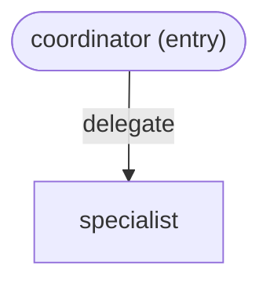

<!-- GENERATED FILE -- do not edit by hand.
     Regenerate with `commonadk.mermaid.write_interaction_layer`
     (or `commonadk render`) from interactions.yaml. -->

# Interaction Layer

```mermaid
flowchart TD
    coordinator(["coordinator (entry)"])
    specialist["specialist"]
    coordinator -- delegate --> specialist
```
