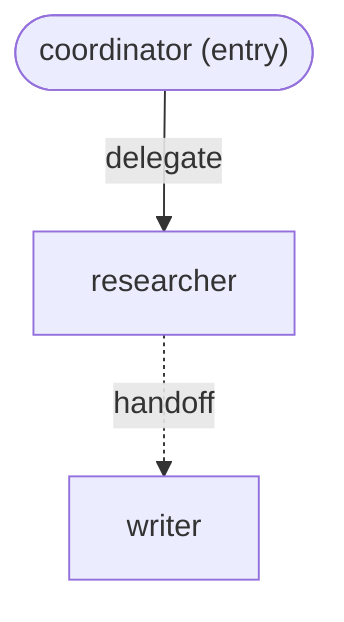

<!-- GENERATED FILE -- do not edit by hand.
     Regenerate with `commonadk.mermaid.write_interaction_layer`
     (or `commonadk render`, once the CLI lands) from interactions.yaml. -->

# Interaction Layer

